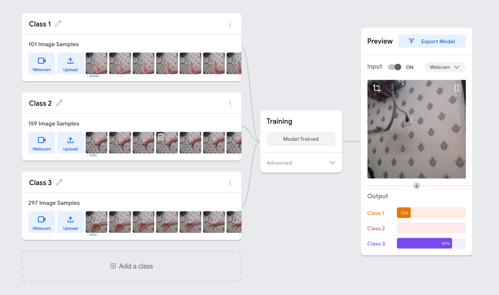
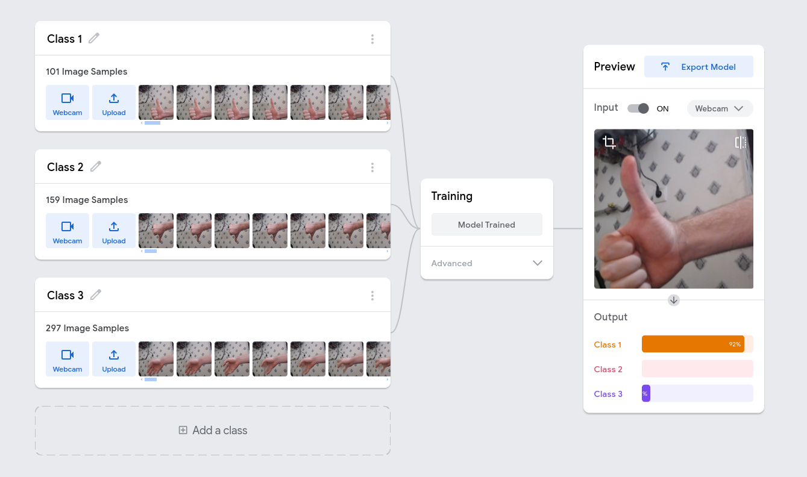
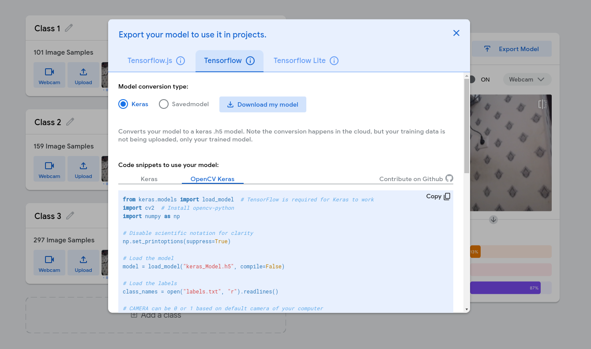
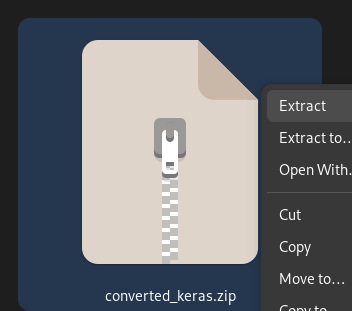
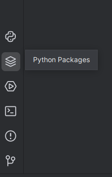

# Завдання

## Згадуємо Python
0. Умовний оператор (if/else). Завдання: Напишіть програму, яка перевіряє, чи число, введене користувачем, парне або непарне.
1. Цикл for з range. Завдання: Напишіть програму, яка виводить таблицю множення для числа 7.
2. Робота зі списками, індексами та slice. Завдання: Створіть список з п'яти улюблених ігор і виконайте наступні дії: Виведіть перший та останній елемент списку. Виведіть середні три елементи за допомогою slice.
3. Використання циклу while. Завдання: Напишіть програму, яка виводить числа від 67 до 77 в квадраті, використовуючи цикл while.
4. Цикл while з використанням break. Завдання: Напишіть програму, яка запитує у користувача числа. Якщо користувач вводить негативне число, програма зупиняється.


## Teachable Machine
1. Переходимо на сайт https://teachablemachine.withgoogle.com/
2. Тиснемо "Get Started" і на наступній сторінці обираємо "Image Project" -> "Standart image model" https://teachablemachine.withgoogle.com/train/image
3. Маємо опинитись на наступній сторінці 
4. Тут необхідно за допомогою веб камери створити датасет для класифікації жестів. Тут на прикладі було додано 3 класси: 1 - Знак Ок, 2 - знак не ок, 3 - всі інші положення рукою. Пам'ятайте, чим більше різноманітних прикладів ви подасте до тренування - тим краще буде результат.
5. Після того як ви зберете датасет необхідно натиснути Train Model - і дочекатись кінця  тренування моделі.
6. Далі ви зможете Протестити чи правильно ваша модель працює в веб режимі на єтапі Preview 
7. Коли модель натренована, натискаємо "Export Model" і далі натискаємо на вкладці "Tensorflow" кнопку "Download my model" 
8. Скачається zip архів який необхідно буде розпакувати 
9. Створюємо в PyCharm проект і перетягуємо розпакований файл keras_model.h5 в корінь свого проекту
10. встановлюємо залежності ```pip install keras numpy opencv-python keyboard``` (це пакети які необхідні для нашого проекту) (можна через pip або через pycharm в вкладці Python Packages по черзі) 
11. Бібліотека keyboard необхідна щоб імітувати з python натискання клавіш. Нижче Приклад коду для тесту. Запускаємо перевіряємо чи працює.
```python
import keyboard

# Симулюємо натискання клавіші 'a'
keyboard.press_and_release('a')

# Відслідковуємо натискання клавіші 'q'
keyboard.on_press_key('q', lambda _: print("Клавішу 'q' натиснуто"))
```
12. Ваша задача дописати код, щоб ви могли жестами керувати вашим компбютером. Наприклад на жест "OK" зробити щоб натискалась клавіша "pageup", а на жест "Not OK" натискалась клавіша "pagedown".  Основний код який необхідно буде модифікувати: (для початку запускаємо тестуємо чи все працює)
```python
# Цей код використовує штучний інтелект для розпізнавання об'єктів на зображенні з веб-камери

# Підключаємо потрібні інструменти (бібліотеки)
from keras.models import load_model  # Ця штука допомагає нам використовувати навчену модель штучного інтелекту
import cv2  # Це допомагає нам працювати з камерою і зображеннями
import numpy as np  # Це допомагає нам працювати з числами і масивами

# Налаштовуємо як виводити числа, щоб було зрозуміліше
np.set_printoptions(suppress=True)

# Завантажуємо навчену модель штучного інтелекту
model = load_model("keras_model.h5", compile=False)

# назви об'єктів, які наша модель вміє розпізнавати відповідають класс 1, класс 2, класс 3 по індексу
class_names = [
    "OK",
    "NOT OK",
    "OTHER"
]

# Вмикаємо камеру (0 - це зазвичай вбудована камера, 1 - зовнішня)
camera = cv2.VideoCapture(0)

# Запускаємо безкінечний цикл, щоб постійно отримувати зображення з камери
while True:
    # Отримуємо кадр (фотографію) з камери
    ret, image = camera.read()

    # Показуємо фотографію у вікні на екрані
    cv2.imshow("Video", image)

    # Змінюємо розмір фотографії, щоб вона підходила для нашої моделі
    image = cv2.resize(image, (224, 224), interpolation=cv2.INTER_AREA)

    # Перетворюємо фотографію у формат, який розуміє наша модель
    image = np.asarray(image, dtype=np.float32).reshape(1, 224, 224, 3)

    # Нормалізуємо значення пікселів (робимо їх в діапазоні від -1 до 1)
    image = (image / 127.5) - 1

    # Просимо модель розпізнати, що на фотографії
    prediction = model.predict(image)

    # Визначаємо, який об'єкт модель "побачила" з найбільшою впевненістю
    index = np.argmax(prediction)
    class_name = class_names[index]
    confidence_score = prediction[0][index]

    # Виводимо результат: що модель "побачила" і наскільки вона в цьому впевнена
    print("Об'єкт:", class_name)
    print("Впевненість:", confidence_score)

    # Перевіряємо, чи не натиснута клавіша на клавіатурі ESC
    keyboard_input = cv2.waitKey(1)

    # Якщо натиснута клавіша ESC (код 27), зупиняємо програму
    if keyboard_input == 27:
        break

# Вимикаємо камеру і закриваємо всі вікна
camera.release()
cv2.destroyAllWindows()
```
13. Ускладнення 1: Не виводимо відео - программа повинна працювати в фоні - і не виводити відео
14. Ускладнення 2: Виконуємо натискання клавіші тільки якщо точність предікту моделі більше 90%
15. Ускладнення 3: Робимо так що якщо на двох кадрах підряд розпізнався однаковий жест, то тільки тоді виконуємо натискання клавіш.
16. Ускладнення 4: Розширений функціонал керування. Додайте більше жестів та відповідних дій (наприклад, керування гучністю, перемикання між вікнами тощо).
17. Ускладнення 9: Розпізнавання послідовності жестів. Навчіть програму розпізнавати не тільки окремі жести, але й їх послідовності для виконання складніших команд.

### Примітк:
1. Переконайтесь що ваша модель збережена саме в корні вашого проекту і що тут в коді до неїї стойть вірний шлях
```python
model = load_model("keras_model.h5", compile=False)
```
2. Переконайтесь що назви классів вказані вірно
```python
class_names = [
    "OK",
    "NOT OK",
    "OTHER"
]
```


### Всі клавіши keyboard
['\t', '\n', '\r', ' ', '!', '"', '#', '$', '%', '&', "'", '(',
')', '*', '+', ',', '-', '.', '/', '0', '1', '2', '3', '4', '5', '6', '7',
'8', '9', ':', ';', '<', '=', '>', '?', '@', '[', '\\', ']', '^', '_', '`',
'a', 'b', 'c', 'd', 'e','f', 'g', 'h', 'i', 'j', 'k', 'l', 'm', 'n', 'o',
'p', 'q', 'r', 's', 't', 'u', 'v', 'w', 'x', 'y', 'z', '{', '|', '}', '~',
'accept', 'add', 'alt', 'altleft', 'altright', 'apps', 'backspace',
'browserback', 'browserfavorites', 'browserforward', 'browserhome',
'browserrefresh', 'browsersearch', 'browserstop', 'capslock', 'clear',
'convert', 'ctrl', 'ctrlleft', 'ctrlright', 'decimal', 'del', 'delete',
'divide', 'down', 'end', 'enter', 'esc', 'escape', 'execute', 'f1', 'f10',
'f11', 'f12', 'f13', 'f14', 'f15', 'f16', 'f17', 'f18', 'f19', 'f2', 'f20',
'f21', 'f22', 'f23', 'f24', 'f3', 'f4', 'f5', 'f6', 'f7', 'f8', 'f9',
'final', 'fn', 'hanguel', 'hangul', 'hanja', 'help', 'home', 'insert', 'junja',
'kana', 'kanji', 'launchapp1', 'launchapp2', 'launchmail',
'launchmediaselect', 'left', 'modechange', 'multiply', 'nexttrack',
'nonconvert', 'num0', 'num1', 'num2', 'num3', 'num4', 'num5', 'num6',
'num7', 'num8', 'num9', 'numlock', 'pagedown', 'pageup', 'pause', 'pgdn',
'pgup', 'playpause', 'prevtrack', 'print', 'printscreen', 'prntscrn',
'prtsc', 'prtscr', 'return', 'right', 'scrolllock', 'select', 'separator',
'shift', 'shiftleft', 'shiftright', 'sleep', 'space', 'stop', 'subtract', 'tab',
'up', 'volumedown', 'volumemute', 'volumeup', 'win', 'winleft', 'winright', 'yen',
'command', 'option', 'optionleft', 'optionright']