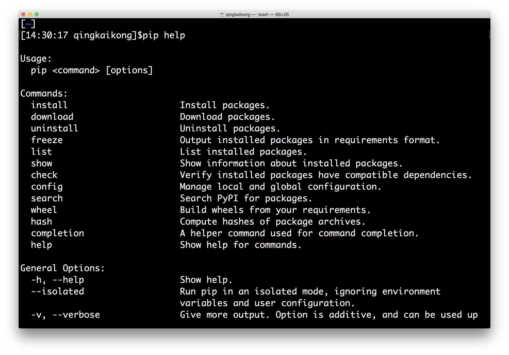
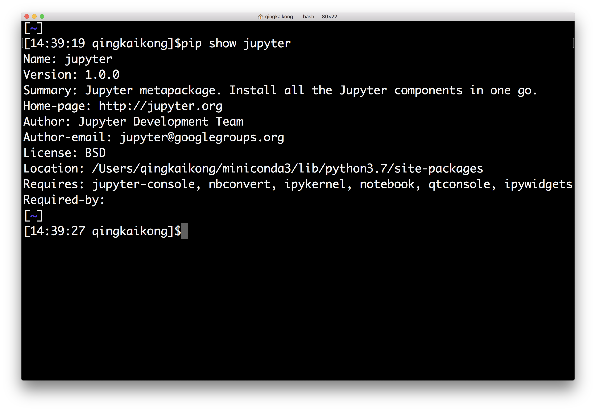

<h1>Керування пакетами</h1>

Одна з особливостей, яка робить Python справді чудовим, — це різноманітні пакети/модулі, розроблені спільнотою. Найчастіше, коли ви хочете використовувати якісь функції чи алгоритми, ви побачите, що, можливо, вже існує декілька пакетів від спільноти, які закодували це для вас, і все, що вам потрібно зробити, — це встановити пакети та використовувати їх у своєму коді. Тому керування пакетами є однією з найважливіших навичок, які вам потрібно засвоїти, щоб повною мірою скористатися перевагами Python. У цьому розділі ми покажемо вам, як керувати пакетами в Python.

<h2>Керування пакетами за допомогою менеджерів пакетів</h2>

На початку ми встановили деякі пакети за допомогою pip, ввівши <em>pip install package_name</em>. Це найпоширеніший і найпростіший спосіб встановлення пакетів Python у наші дні. Pip — це менеджер пакетів, який автоматизує процес встановлення, оновлення та видалення пакетів. Він може встановлювати пакети, опубліковані в <a href="https://pypi.org/">Python Package Index (PyPI)</a>. Коли ми встановили інсталятор Miniconda, він також встановив pip для вашого використання.

Перш за все, ви можете використовувати <em>pip help</em>, щоб отримати допомогу щодо різних команд, як показано нижче.

Але найчастіше використовувані команди зазвичай включають: встановлення, оновлення та видалення пакета.

<h3>Встановлення пакета</h3>

Щоб встановити останню версію package_name:

<pre>pip install package_name
</pre>

Щоб встановити певну версію:

<pre>pip install package_name==1.5
</pre>

Pip встановить пакет, а також залежності для вашого використання.

<h3>Оновлення пакета</h3>

Щоб оновити встановлений пакет до останньої версії з PyPI.

<pre>pip install --upgrade package_name
</pre>

або просто

<pre>pip install -U package_name
</pre>

<h3>Видалення пакета</h3>
<pre>pip uninstall package_name
</pre>

<h3>Інші корисні команди</h3>

Існують деякі інші корисні команди, які ви зазвичай використовуєте для отримання інформації про встановлені пакети. Наприклад, якщо ви хочете отримати список усіх встановлених пакетів, ви можете використати команду:

<pre>pip list
</pre>

Якщо ви хочете дізнатися більше про встановлений пакет, наприклад, його місцезнаходження, необхідні залежності тощо, ви можете використати:

<pre>pip show package_name
</pre>

Існують інші менеджери пакетів, як-от conda, що постачається з дистрибутивом Anaconda, але за використанням він схожий на pip, тому ми не будемо тут багато про це говорити, ви можете знайти більше інформації, прочитавши <a href="https://conda.io/docs/user-guide/getting-started.html">документацію</a>.

<h2>Встановлення пакетів з вихідного коду</h2>

Іноді вам потрібно завантажити вихідний файл для якогось проєкту, якого немає в PyPI, тоді вам потрібен інший спосіб встановлення пакета. Після розпакування завантаженого файлу ви зазвичай можете побачити, що папка містить скрипт налаштування <em>setup.py</em> та файл з назвою README, в якому описано, як зібрати та встановити модуль. У більшості випадків вам просто потрібно виконати одну команду з термінала, щоб встановити пакет:

<pre>python setup.py install
</pre>

Зверніть увагу, користувачам Windows потрібно виконувати команду з вікна командного рядка:

<pre>setup.py install
</pre>

Тепер ви знаєте, як керувати пакетами в Python, що є великим кроком вперед до правильного використання Python, і в наступному розділі ми поговоримо більше про Jupyter notebook, який ми будемо використовувати і далі.

