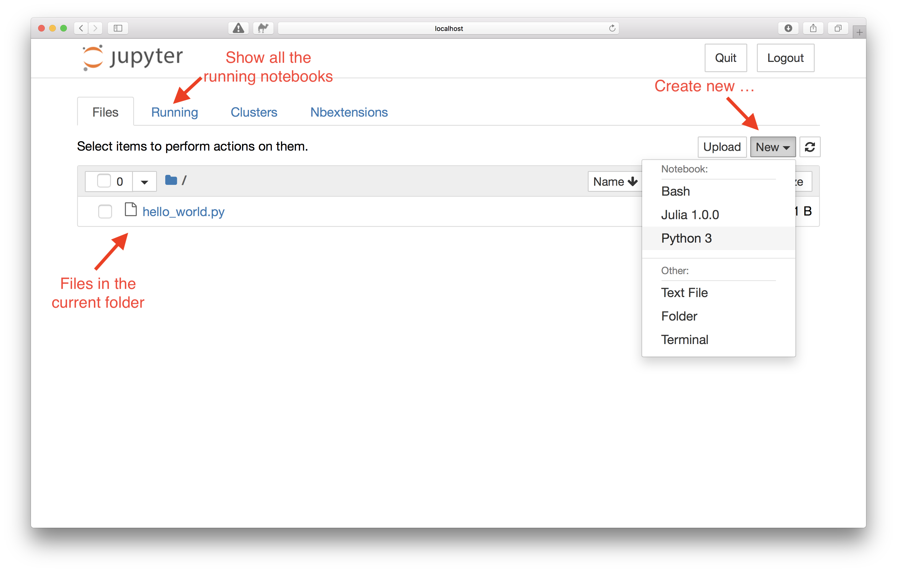
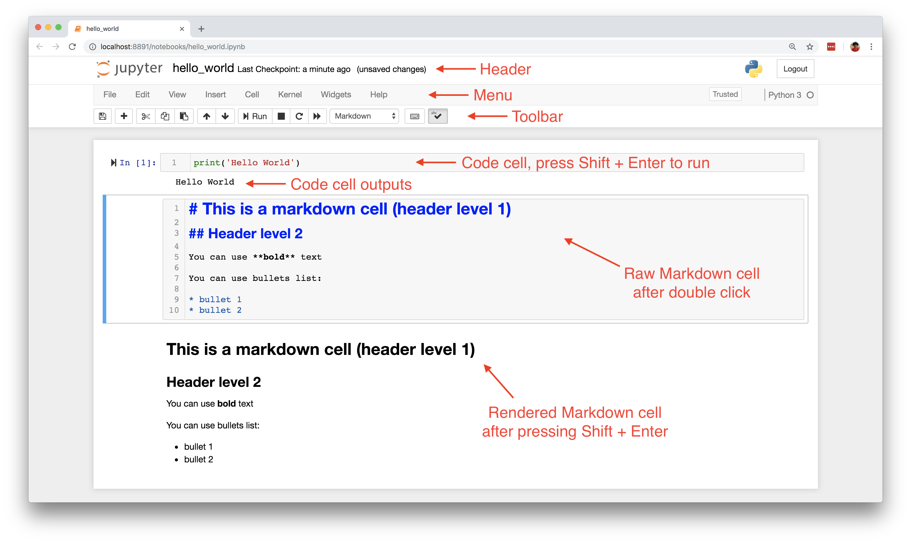

<h1>Вступ до Jupyter Notebook</h1>

Ви вже використовували оболонку IPython для виконання коду рядок за рядком. Це добре, але якщо у вас є більше рядків коду і ви хочете виконувати його блок за блоком та легко ділитися ним з іншими, оболонка IPython не є найкращим варіантом. У цьому розділі ми представимо інший варіант – Jupyter Notebook, який ми будемо використовувати протягом решти курсу. З <a href="http://jupyter.org/">веб-сайту Jupyter Notebook</a>:

<blockquote>

Jupyter Notebook – це веб-додаток з відкритим вихідним кодом, який дозволяє створювати та ділитися документами, що містять живий код, рівняння, візуалізації та наративний текст. Використання включає: очищення та трансформацію даних, чисельне моделювання, статистичне моделювання, візуалізацію даних, машинне навчання та багато іншого.

</blockquote>

Jupyter Notebook працює за допомогою вашого браузера, він може запускатися локально на вашій машині як локальний сервер або віддалено на сервері. Причина, чому його називають блокнотом (notebook), полягає в тому, що він може містити живий код, елементи форматованого тексту, такі як рівняння, посилання, зображення, таблиці тощо. Таким чином, ви можете мати дуже гарний блокнот для опису вашої ідеї та живого коду в одному документі. Таким чином, Jupyter Notebook стає дуже популярним способом тестування ідей, написання блогів, статей і навіть книг; наприклад, ця книга повністю написана в Jupyter Notebook. Звісно, він має багато інших переваг, і ми розглянемо лише основи Jupyter Notebook, щоб ви могли розпочати роботу.

<h2>Запуск Jupyter Notebook</h2>

Раніше ми бачили, що Jupyter Notebook можна запустити, набравши наступну команду в терміналі у папці, де ви хочете зберігати блокноти:

<pre>jupyter notebook
</pre>

Потім ви побачите панель керування Jupyter Notebook у браузері, адреса за замовчуванням: http://localhost:8888, тобто на локальному хості з портом 8888, як показано на наступному малюнку (якщо порт 8888 зайнятий іншими Jupyter Notebook, то він автоматично використає інший порт). Це по суті створює локальний сервер для роботи у вашому браузері. Коли ви перейдете до браузера, ви побачите панель керування. На цій панелі керування ви можете побачити деякі важливі функції, позначені червоним: ви можете бачити всі файли в поточній папці, показувати всі запущені блокноти та створювати новий блокнот або інші елементи, такі як текстовий файл, папку та термінал. Ми можемо створити новий блокнот Python, вибравши Python 3; зазвичай це називається ядром Python. Ви також можете використовувати Jupyter для запуску інших ядер, наприклад, на наступному малюнку є ядра Bash та Julia, які ви могли б запускати як блокнот, але спочатку вам потрібно їх встановити. Ми будемо використовувати ядро Python, тому оберіть ядро Python 3.

<h2>У блокноті</h2>

Після створення нового блокнота Python він виглядатиме як на наступному малюнку. Панель інструментів та меню є зрозумілими: коли ви наводите курсор на панель інструментів, вона показує функцію інструмента, а при натисканні на меню з'являється випадаючий список. Найважливіше, що потрібно знати про Jupyter Notebook, це комірки та їхні різні типи. У блокноті комірка – це місце, де ви можете писати свій код або текст, і запускати цю комірку, щоб виконати лише код у цьому блоці комірки. Два важливі типи комірок – це код і Markdown; комірка коду – це місце, де ви вводите свій код і можете його запускати. Комірка Markdown – це місце, де ви можете ввести опис у форматі форматованого тексту, дивіться наступний малюнок як приклад. Ви можете пошукати «Markdown cheatsheet», щоб швидко розпочати роботу з Markdown. Запустити код або перерендерити Markdown у блокноті просто: достатньо натиснути Shift + Enter.

У блокноті ви можете переміщувати комірки вгору або вниз, вставляти або видаляти комірки тощо. Jupyter Notebook має багато інших чудових функцій, ми не будемо багато про них говорити тут, але ви можете знайти багато онлайн-уроків, щоб дізнатися більше.

<h2>Вимкнення Jupyter Notebook</h2>

Закриття браузера не призведе до закриття Jupyter Notebook, оскільки сервер все ще працює. Ви можете знову відкрити попередню адресу в браузері. Щоб повністю його вимкнути, нам потрібно закрити пов'язаний термінал, з якого ви запустили Jupyter Notebook.

<h2>Закриття блокнота</h2>

Коли ви закриваєте вкладку браузера з блокнотом, блокнот насправді не закривається, він все ще працює у фоновому режимі. Якщо вам потрібно повністю закрити блокнот, перейдіть на панель керування, встановіть прапорець перед блокнотом, і ви побачите опцію вимкнення на панелі інструментів вище – це правильний спосіб повністю закрити блокнот.

Гаразд, тепер у вас є базові знання для запуску та роботи з Jupyter Notebook, і настав час продовжити вивчення Python.

