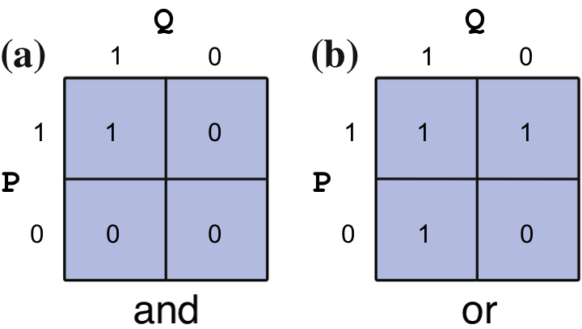

<h1>Логічні вирази та оператори</h1>

**Логічний вираз** — це твердження, яке може бути істинним або хибним. Наприклад, \(a &lt; b\) є логічним виразом. Він може бути істинним або хибним залежно від заданих значень \(a\) та \(b\). Зауважте, що це відрізняється від **математичного виразу**, який позначає твердження про істинність. У попередньому прикладі математичний вираз \(a &lt; b\) означає, що \(a\) менше за \(b\), і значення \(a\) та \(b\), де \(a \ge b\), не допускаються. Логічні вирази становлять основу обчислень, тому для цілей ціього курсу всі твердження вважаються логічними, а не математичними, якщо не вказано інше.

У Python логічний вираз, який є істинним, обчислюється до значення "True". Хибний вираз обчислюється до значення "False". Це новий тип даних, з яким ми стикаємося — **булевий**, який має вбудовані значення <code>True</code> та <code>False</code>. Для наших цілей "True" еквівалентно 1, а "False" еквівалентно 0. Розрізнення між числами 1 і 0 та логічними значеннями "True" і "False" виходить за рамки ціього курсу, але розглядається в більш поглиблених книгах з обчислювальної техніки. Логічні вирази використовуються для постановки запитань до Python. Наприклад, "\(3 &lt; 4\)" еквівалентно "Чи 3 менше за 4?" Оскільки це твердження є істинним, Python обчислить його як 1. Однак \(3 &gt; 4\) є хибним, тому Python обчислить його як 0.

**Оператори порівняння** порівнюють значення двох чисел і використовуються для побудови логічних виразів. Python резервує символи \(&gt;, &gt;=, &lt;, &lt;=, !=, ==\) для позначення "більше", "більше або дорівнює", "менше", "менше або дорівнює", "не дорівнює" та "дорівнює" відповідно. Розглянемо приклад a = 4, b = 2 та наступну таблицю:

<table>
<thead>
<tr><th>
Оператор
</th>
<th>
Опис
</th>
<th>
Приклад
</th>
<th>
Результати
</th>
</tr>
</thead>
<tbody>
<tr><td>
&gt;
</td>
<td>
більше
</td>
<td>
a &gt; b
</td>
<td>
True
</td>
</tr>
<tr><td>
&gt;=
</td>
<td>
більше або дорівнює
</td>
<td>
a &gt;= b
</td>
<td>
True
</td>
</tr>
<tr><td>
&lt;
</td>
<td>
менше
</td>
<td>
a &lt; b
</td>
<td>
False
</td>
</tr>
<tr><td>
&lt;=
</td>
<td>
менше або дорівнює
</td>
<td>
a &lt;= b
</td>
<td>
False
</td>
</tr>
<tr><td>
!=
</td>
<td>
не дорівнює
</td>
<td>
a != b
</td>
<td>
True
</td>
</tr>
<tr><td>
==
</td>
<td>
дорівнює
</td>
<td>
a == b
</td>
<td>
False
</td>
</tr>
</tbody>
</table>

**СПРОБУЙТЕ!** Обчисліть логічний вираз для "Чи 5 дорівнює 4?" та "Чи 2 менше за 3?"

<pre>5 == 4
</pre>

<pre>False
</pre>

<pre>2 &lt; 3
</pre>

<pre>True
</pre>

**Логічні оператори** — це операції між двома логічними виразами, які для обговорення ми називаємо \(P\) та \(Q\). Основними логічними операторами, які ми будемо використовувати тут, є **and**, **or** та **not**.

<table>
<thead>
<tr><th>
Оператор
</th>
<th>
Опис
</th>
<th>
Приклад
</th>
<th>
Результати
</th>
</tr>
</thead>
<tbody>
<tr><td>
and
</td>
<td>
логічне І
</td>
<td>
P and Q
</td>
<td>
Істина, якщо P і Q обидва істинні Хиба в іншому випадку
</td>
</tr>
<tr><td>
or
</td>
<td>
логічне АБО
</td>
<td>
P or Q
</td>
<td>
Істина, якщо P або Q є істинним Хиба в іншому випадку
</td>
</tr>
<tr><td>
not
</td>
<td>
логічне НЕ
</td>
<td>
not P
</td>
<td>
Істина, якщо P є хибним Хиба, якщо P є істинним
</td>
</tr>
</tbody>
</table>

**Таблиця істинності** логічного оператора або виразу показує результат кожної комбінації істинності \(P\) та \(Q\). Таблиці істинності для "and" та "or" наведені на наступному рисунку.

**СПРОБУЙТЕ!** Припускаючи, що \(P\) є істинним, використайте Python, щоб визначити, чи вираз \((P\ AND\ NOT(Q))\ OR\ (P\ AND\ Q)\) завжди істинний незалежно від того, чи є \(Q\) істинним. Логічно, чи можете ви зрозуміти, чому це так? Спочатку припустимо, що \(Q\) є істинним:

<pre>(1 and not 1) or (1 and 1)
</pre>

<pre>1
</pre>

Тепер припустимо, що \(Q\) є хибним

<pre>(1 and not 0) or (1 and 0)
</pre>

<pre>True
</pre>

Як і арифметичні оператори, логічні оператори мають порядок виконання відносно один одного та відносно арифметичних операторів. Усі арифметичні операції будуть виконані перед операціями порівняння, які будуть виконані перед логічними операціями. Дужки можуть бути використані для зміни порядку виконання операцій.

**СПРОБУЙТЕ!** Обчисліть (1 + 3)&gt;(2 + 5)

<pre>1 + 3 &gt; 2 + 5
</pre>

<pre>False
</pre>

**ПОРАДА!** Навіть коли порядок виконання операцій відомий, зазвичай корисно для вас і тих, хто читає ваш код, використовувати дужки, щоб зробити ваші наміри зрозумілішими. У попередньому прикладі (1 + 3) &gt; (2 + 5) є зрозумілішим.

**УВАГА!** У реалізації логіки Python 1 використовується для позначення істини, а 0 — для хиби. Однак 1 і 0 все ще є числами. Тому Python дозволить такі зловживання, як: (3 &gt; 2) + (5 &gt; 4), що призведе до 2.

<pre>(3 &gt; 2) + (5 &gt; 4)
</pre>

<pre>2
</pre>

**УВАГА!** Хоча у формальній логіці 1 використовується для позначення істини, а 0 — для хиби, Python дещо зловживає нотацією і вважатиме будь-яке число, що не дорівнює 0, істинним при використанні в логічній операції. Наприклад, 3 and 1 обчислиться як істина. Не використовуйте цю особливість Python. Завжди використовуйте 1 для позначення істинного твердження.

**СПРОБУЙТЕ!** Два тижні — це проміжок часу, що складається з 14 днів. Використайте логічний вираз, щоб визначити, чи є більше 100 000 секунд у двох тижнях.

<pre>(14*24*60*60) &gt; 100000
</pre>

<pre>True
</pre>
