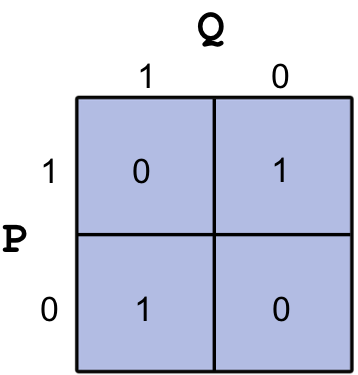

```html
<h1>Підсумок<a href="#summary" title="Permalink to this headline"></a></h1>
<ol>
<li><p>Ви вивчили основи Python для налаштування робочого середовища та способи запуску Python.</p></li>
<li><p>Python можна використовувати як калькулятор. Він має всі функції та арифметичні операції, які зазвичай використовуються в науковому калькуляторі.</p></li>
<li><p>Ви можете керувати пакетами Python.</p></li>
<li><p>Ви навчилися взаємодіяти з Jupyter notebook.</p></li>
<li><p>Ви також можете використовувати Python для виконання логічних операцій.</p></li>
<li><p>Тепер ви знайомі з такими типами даних у Python, як int, float, complex, string, boolean.</p></li>
</ol>


<h1>Задачі<a href="#problems" title="Permalink to this headline"></a></h1>
<ol>
<li><p>Виведіть "I love Python" за допомогою оболонки Python (Python Shell).</p></li>
<li><p>Виведіть "I love Python", ввівши це у файл .py та запустивши його з командного рядка.</p></li>
<li><p>Введіть <em>import antigravity</em> в оболонці Ipython, це перенаправить вас на xkcd, де ви побачите дивовижний Python.</p></li>
<li><p>Запустіть новий сервер Jupyter notebook у папці під назвою "excercis" і створіть новий Python notebook з назвою "excercis_1", після чого ви зможете виконувати решту завдань у цьому нотатнику.</p></li>
<li><p>Обчисліть площу трикутника з основою 10 і висотою 12. Нагадаємо, що площа трикутника дорівнює половині добутку основи на висоту.</p></li>
<li><p>Обчисліть площу поверхні та об'єм циліндра з радіусом 5 і висотою 3.</p></li>
<li><p>Обчисліть нахил між точками <span>\((3,4)\)</span> та <span>\((5,9)\)</span>. Нагадаємо, що нахил між точками <span>\((x_1,y_1)\)</span> та <span>\((x_2, y_2)\)</span> дорівнює <span>\(\frac{y_2 - y_1}{x_2 - x_1}\)</span>.</p></li>
<li><p>Обчисліть відстань між точками <span>\((3,4)\)</span> та <span>\((5,9)\)</span>. Нагадаємо, що відстань між точками у двох вимірах дорівнює <span>\(\sqrt{(x_2 - x_1)^2 + (y_2 - y_1)^2}\)</span>.</p></li>
<li><p>Використовуйте функцію <em>factorial</em> з Python, щоб обчислити <span>\(6!\)</span></p></li>
<li><p>Рік вважається тривалістю 365 днів. Однак точніше значення — 365,24 дня. Як наслідок, якби ми дотримувалися стандартного 365-денного року, ми б поступово втрачали цю частку дня з часом, і пори року та інші астрономічні події відбувалися б не так, як очікувалося. Високосний рік — це рік, який має додатковий день, 29 лютого, щоб підтримувати часову шкалу. Високосні роки трапляються в роки, які точно діляться на 4, за винятком тих, що точно діляться на 100, якщо вони не діляться на 400. Наприклад, 2004 рік є високосним, 1900 рік не є високосним, а 2000 рік є високосним.<br/>
Обчисліть кількість високосних років між 1500 і 2010 роками.</p></li>
<li><p>Дуже потужне наближення для <span>\(\pi\)</span> було розроблено геніальним математиком на ім'я Срініваса Рамануджан. Наближення є таким:<br/>
<span>\(\frac{1}{\pi} \approx \frac{2\sqrt{2}}{9801} \sum_{k=0}^{N} \frac{(4k)!(1103 + 26390k)}{(k!)^4 396^{4k}}\)</span>.<br/>
Використовуйте формулу Рамануджана для <span>\(N = 0\)</span> та <span>\(N = 1\)</span> щоб наблизити <span>\(\pi\)</span>. Обов'язково використовуйте довгий формат (format long). Порівняйте ваше наближення зі збереженим значенням <em>pi</em> у Python. Підказка: <span>\(0! = 1\)</span> за визначенням.</p></li>
<li><p>Гіперболічний <span>\(sin\)</span> або <span>\(sinh\)</span> визначається через експоненти як <span>\(sinh(x) = \frac{\exp(x) - \exp(-x)}{2}\)</span>.<br/>
Обчисліть <span>\(sinh\)</span> для <span>\(x = 2\)</span> за допомогою експонент. Перевірте, що результат дійсно є гіперболічним <span>\(sin\)</span>, використовуючи функцію <em>sinh</em> з модуля math у Python.</p></li>
<li><p>Перевірте, що <span>\(\sin^2(x) + \cos^2(x) = 1\)</span> для <span>\(x = \pi, \frac{\pi}{2}, \frac{\pi}{4}, \frac{\pi}{6}\)</span>.</p></li>
<li><p>Обчисліть <span>\(\sin87\)</span>°.</p></li>
<li><p>Напишіть вираз Python, який генерує таку помилку:<br/>
"AttributeError: module ‘math` has no attribute ‘sni`"<br/>
Підказка: sni — це помилкове написання функції <em>sin</em>.</p></li>
<li><p>Напишіть вираз Python, який генерує таку помилку:<br/>
"TypeError: sin() takes exactly one argument (0 given)"<br/>
Підказка: Вхідні аргументи стосуються вхідних даних функції (будь-якої функції); наприклад, вхідними даними у <span>\(sin(pi/2)\)</span> є <span>\(pi/2\)</span>.</p></li>
<li><p>Якщо <span>\(P\)</span> є логічним виразом, закон суперечності стверджує, що <span>\(P\ AND\ (NOT\ P)\)</span> завжди є хибним. Перевірте це для <span>\(P\)</span> істинного та <span>\(P\)</span> хибного.</p></li>
<li><p>Нехай P та Q є логічними виразами. Правило де Моргана стверджує, що <span>\(NOT\ (P\ OR\ Q)\ =\ (NOT\ P)\ AND\
(NOT\ Q)\)</span> та <span>\(NOT\ (P\ AND\ Q)\ =\ (NOT\ P)\ OR\ (NOT\ Q)\)</span>. Створіть таблиці істинності для кожного твердження, щоб показати, що правило де Моргана завжди є істинним.</p></li>
<li><p>За яких умов для <span>\(P\)</span> та <span>\(Q\)</span> вираз (<span>\(P\ AND\ Q)\ OR\ (P\ AND\ (NOT\ Q)\)</span>) є хибним?</p></li>
<li><p>Створіть еквівалентний логічний вираз для OR, використовуючи лише AND та NOT.</p></li>
<li><p>Створіть еквівалентний логічний вираз для AND, використовуючи лише OR та NOT.</p></li>
<li><p>Логічний оператор XOR має таку таблицю істинності:<br/>
Створіть еквівалентний логічний вираз для XOR, використовуючи лише AND, OR та NOT, який має таку ж таблицю істинності (див. наступний малюнок)</p></li>
</ol>
<p></p>
<ol>
<li><p>Виконайте наступне обчислення в командному рядку Python.<br/>
<span>\(e^{2}\sin{\pi/6} + log_e(3)\cos{\pi/9}-5^3\)</span></p></li>
<li><p>Виконайте наступні логічні операції та операції порівняння в командному рядку Python. Можна припустити, що P та Q є логічними виразами.<br/>
Для P = 1 та Q = 1; обчисліть <span>\(NOT(P)\ AND\ NOT(Q)\)</span>.<br/>
Для a = 10 та b = 25; обчисліть <span>\((a&lt;b)\ AND\ (a=b)\)</span>.</p></li>
</ol>
```
