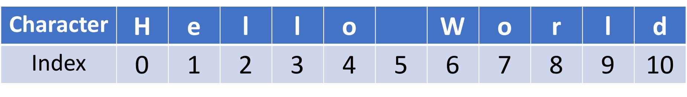

<h1>Структура даних - Рядки</h1>

Ми говорили про різні типи даних, такі як int, float та boolean, усі вони пов'язані з одним значенням. Решта цього розділу познайомить вас з іншими типами даних, щоб ми могли зберігати кілька значень. Структури даних, пов'язані з цими новими типами, це Рядки, Списки, Кортежі, Множини та Словники. Ми почнемо з рядків.

Рядок — це послідовність символів, наприклад "Hello World", який ми бачили в розділі 1. Рядки оточені одинарними або подвійними лапками. Ми можемо використовувати функцію <em>print</em> для виведення рядків на екран.

<strong>СПРОБУЙТЕ!</strong> Виведіть "I love Python!" на екран.

<pre>print("I love Python!")
</pre>

<strong>СПРОБУЙТЕ!</strong> Присвойте символ "S" змінній з іменем s. Присвойте рядок "Hello World" змінній w. Перевірте, що s та w мають тип рядка, використовуючи функцію <em>type</em>.

<pre>s = "S"
w = "Hello World"
</pre>

<pre>type(s)
</pre>

<pre>str
</pre>

<pre>type(w)
</pre>

<pre>str
</pre>

Зауважте, що пробіл, " ", між "Hello" та "World" також є типом <em>str</em>. Будь-який символ може бути символом, навіть ті, що зарезервовані для операторів. Зауважте, що як <em>str</em>, вони не виконують ту саму функцію. Хоча вони виглядають однаково, Python інтерпретує їх абсолютно по-різному.

<strong>СПРОБУЙТЕ!</strong> Створіть порожній рядок. Перевірте, що порожній рядок є <em>str</em>.

<pre>s = " "
type(s)
</pre>

<pre>str
</pre>

Рядок — це масив символів, тому він має довжину, щоб вказувати розмір рядка. Наприклад, ми можемо перевірити розмір рядка за допомогою вбудованої функції <em>len</em>.

<pre>len(w)
</pre>

<pre>11
</pre>

Рядки також мають індекси, щоб вказувати розташування кожного символу, завдяки чому ми можемо легко знайти певний символ. Індекс позиції починається з 0, як показано на наступному зображенні.

Ми можемо отримати доступ до будь-якого символу, використовуючи квадратні дужки та індекс позиції. Наприклад, якщо ми хочемо отримати символ ‘W`, то нам потрібно зробити:

<pre>w[6]
</pre>

<pre>'W'
</pre>

Ми також можемо вибрати послідовність за допомогою зрізів рядків. Наприклад, якщо ми хочемо отримати "World", ми можемо виконати наступну команду.

<pre>w[6:11]
</pre>

<pre>'World'
</pre>

[6:11] означає, що початкова позиція — це індекс 6, а кінцева позиція — індекс 10. Для діапазону зрізів рядків Python верхня межа є виключною, що означає, що [6:11] фактично зрізає символи з 6 -> 10. Синтаксис для зрізів у Python: [start:end:step], третій елемент — step — є необов'язковим.

Ви можете ігнорувати кінцеву позицію, якщо хочете зробити зріз до кінця рядка. Наприклад, наступна команда ідентична попередній:

<pre>w[6:]
</pre>

<pre>'World'
</pre>

<strong>СПРОБУЙТЕ!</strong> Отримайте слово "Hello" з рядка <em>w</em>.

<pre>w[:5]
</pre>

<pre>'Hello'
</pre>

Ви також можете використовувати від'ємний індекс при зрізанні рядків, що означає відлік з кінця рядка. Наприклад, -1 означає останній символ, -2 — передостанній і так далі.

<strong>СПРОБУЙТЕ!</strong> Зробіть зріз "Wor" зі слова "World".

<pre>w[6:-2]
</pre>

<pre>'Wor'
</pre>

<strong>СПРОБУЙТЕ!</strong> Отримайте кожен другий символ у змінній <em>w</em>

<pre>w[::2]
</pre>

<pre>'HloWrd'
</pre>

Рядки не можуть використовуватися в математичних операціях.

<strong>СПРОБУЙТЕ!</strong> Використайте ‘+` для додавання двох чисел. Перевірте, що "+" не поводиться як оператор додавання, <code>+</code>.

<pre>1 "+" 2
</pre>

<pre>  File "&lt;ipython-input-13-46b54f731e00&gt;", line 1
    1 "+" 2
        ^
SyntaxError: invalid syntax
</pre>

<strong>УВАГА!</strong> Числа також можуть бути виражені як <em>str</em>. Наприклад, <code>x = '123'</code> означає, що x — це рядок 123, а не число 123. Однак рядки представляють слова або текст, тому для них не повинно бути визначено додавання.

<strong>ПОРАДА!</strong> Ви можете опинитися в ситуації, коли захочете використовувати апостроф як <em>str</em>. Це проблематично, оскільки апостроф використовується для позначення рядків. На щастя, апостроф можна використовувати в рядку наступним чином. Зворотний слеш (\) — це спосіб повідомити Python, що це частина рядка, а не позначення рядків. Символ зворотного слеша використовується для екранування символів, які інакше мають особливе значення, таких як новий рядок, сам зворотний слеш або символ лапок.

<pre>'don\'t'
</pre>

<pre>"don't"
</pre>

Один рядок може бути об'єднаний з іншим рядком. Наприклад:

<pre>str_a = "I love Python! "
str_b = "You too!"

print(str_a + str_b)
</pre>

<pre>I love Python! You too!
</pre>

Ми також можемо перетворювати інші типи даних на рядки за допомогою вбудованої функції <em>str</em>. Це корисно, наприклад, якщо у нас є змінна x, яка зберігає 1 як ціле число, і ми хочемо вивести її безпосередньо з рядком, ми отримаємо помилку, що не можемо об'єднати рядок з цілим числом.

<pre>x = 1
print("x = " + x)
</pre>

<pre>---------------------------------------------------------------------------
TypeError                                 Traceback (most recent call last)
&lt;ipython-input-16-3e562ba0dd83&gt; in &lt;module&gt;()
      1 x = 1
----&gt; 2 print("x = " + x)

TypeError: can only concatenate str (not "int") to str
</pre>

Правильний спосіб зробити це — спочатку перетворити ціле число на рядок, а потім вивести його.

<strong>СПРОБУЙТЕ!</strong> Виведіть <em>x = 1</em> на екран.

<pre>print("x = " + str(x))
</pre>

<pre>x = 1
</pre>

<pre>type(str(x))
</pre>

<pre>str
</pre>

У Python рядок є об'єктом, який має різні методи, що можуть бути використані для маніпулювання ним (ми поговоримо про об'єктно-орієнтоване програмування пізніше). Спосіб отримати доступ до різних методів — це використовувати шаблон "string.method_name".

<strong>СПРОБУЙТЕ!</strong> Перетворіть змінну w на верхній регістр.

<pre>w.upper()
</pre>

<pre>'HELLO WORLD'
</pre>

<strong>СПРОБУЙТЕ!</strong> Підрахуйте кількість входжень літери "l" у w.

<pre>w.count("l")
</pre>

<pre>3
</pre>

<strong>СПРОБУЙТЕ!</strong> Замініть "World" у змінній w на "Berkeley".

<pre>w.replace("World", "Berkeley")
</pre>

<pre>'Hello Berkeley'
</pre>

Існують різні способи попереднього форматування рядка. Тут ми представимо два способи зробити це. Наприклад, якщо у нас є дві змінні <em>name</em> та <em>country</em>, і ми хочемо вивести їх у реченні, але не хочемо використовувати конкатенацію рядків, яку ми використовували раніше, оскільки це призведе до багатьох знаків ‘+` у рядку. Замість цього ми можемо зробити наступне:

<pre>name = "UC Berkeley"
country = 'USA'

print("%s is a great school in %s!"%(name, country))
</pre>

<pre>UC Berkeley is a great school in USA!
</pre>

<strong>ЩО ВІДБУВАЄТЬСЯ?</strong> У попередньому прикладі %s у подвійних лапках повідомляє Python, що ми хочемо вставити деякі рядки в це місце (s у цьому випадку означає string — рядок). <em>%(name, country)</em> — це місце, куди ми хочемо вставити два рядки.

<strong>НОВИНКА!</strong> Існує інший спосіб, представлений лише в Python 3.6 і вище, він називається f-рядок (f-String), що означає форматований рядок (formated-String). Ви можете легко форматувати рядок за допомогою наступного рядка:

<pre>print(f"{name} is a great school in {country}.")
</pre>

<pre>UC Berkeley is a great school in USA.
</pre>

Ви навіть можете вивести числовий вираз без перетворення типу даних, як ми робили раніше.

<strong>СПРОБУЙТЕ!</strong> Виведіть результат <em>3*4</em> безпосередньо за допомогою f-рядка.

<pre>print(f"{3*4}")
</pre>

<pre>12
</pre>

Гаразд, ми багато чого дізналися про структуру даних — рядок, це наша перша послідовна структура даних. Давайте дізнаємося більше зараз.

