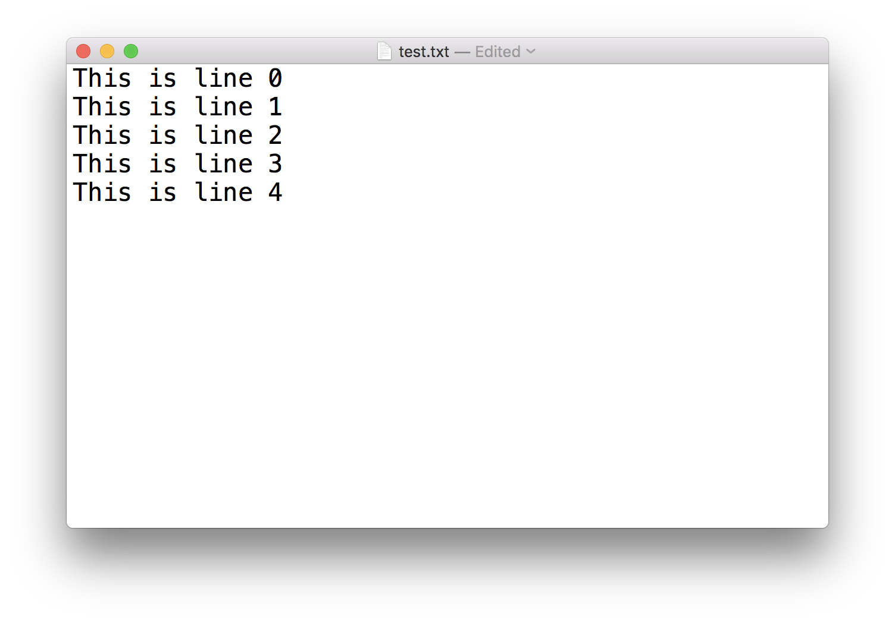
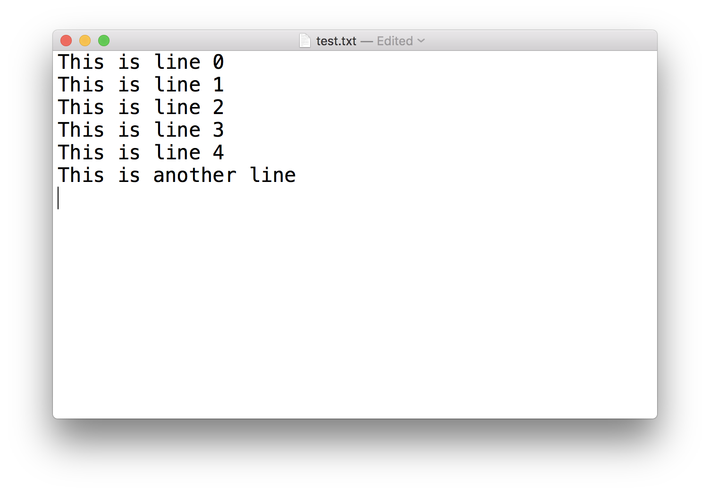
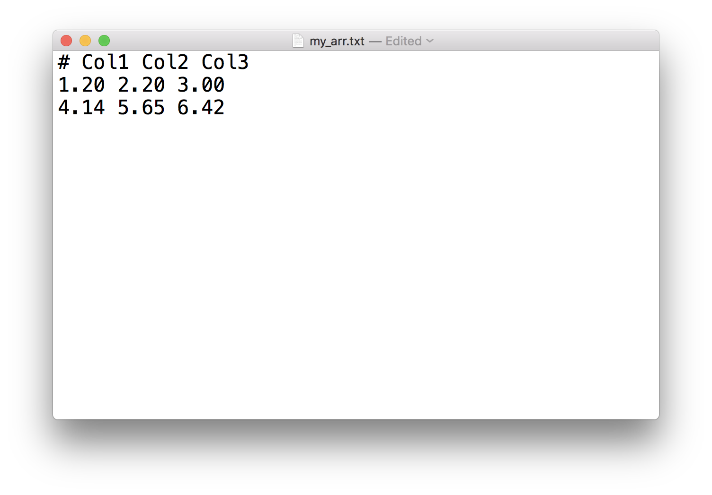

<h1>Текстові файли</h1>

Досі ми використовували функцію <em>print</em> для відображення даних на екрані. Але існує багато способів зберігати дані на диск і ділитися ними з іншими програмами чи колегами. Наприклад, якщо у мене є деякі рядки в цьому блокноті, але я хочу використовувати їх в іншому блокноті, найпростіший спосіб — зберегти рядки в текстовий файл, а потім відкрити його в іншому блокноті. <strong>Текстовий</strong> файл, часто з розширенням <strong>.txt</strong>, — це файл, що містить лише звичайний текст. Однак програми, які ви пишете, і програми, які читають ваш текстовий файл, зазвичай очікують, що текстовий файл буде у певному форматі; тобто організований певним чином.

Для роботи з текстовими файлами нам потрібно використовувати функцію <em>open</em>, яка повертає <em>об'єкт файлу</em>. Вона зазвичай використовується з двома аргументами:

<pre>f = open(filename, mode)
</pre>

<em>f</em> — це повернутий об'єкт файлу. Ім'я файлу — це рядок, що вказує розташування файлу, який ви хочете відкрити, а <em>режим</em> — це інший рядок, що містить кілька символів, які описують спосіб використання файлу; поширені режими:

<ul>
<li>
‘r`, це режим за замовчуванням, який відкриває файл для читання
</li>
<li>
‘w`, цей режим відкриває файл для запису; якщо файл не існує, він створює новий файл.
</li>
<li>
‘a`, відкриває файл у режимі дозапису, додає дані в кінець файлу. Якщо файл не існує, він створює новий файл.
</li>
<li>
‘b`, відкриває файл у бінарному режимі.
</li>
<li>
‘r+`, відкриває файл (не створює) для читання та запису.
</li>
<li>
‘w+`, відкриває або створює файл для запису та читання, відкидає існуючий вміст.
</li>
<li>
‘a+`, відкриває або створює файл для читання та запису, і додає дані в кінець файлу.
</li>
</ul>

<h2>Запис у файл</h2>

<strong>СПРОБУЙТЕ!</strong> Створіть текстовий файл під назвою <em>test.txt</em> і запишіть у нього кілька рядків.

<pre>f = open('test.txt', 'w')
for i in range(5):
    f.write(f"This is line {i}\n")
    
f.close()
</pre>

Ми бачимо з коду вище, що ми спочатку відкрили об'єкт файлу <em>f</em> з ім'ям файлу ‘test.txt`. Ми використали "w+" для режиму, що вказує на запис. Потім ми записуємо 5 рядків (зверніть увагу на символ нового рядка ‘\n` в кінці рядка), а потім закриваємо об'єкт файлу. Вміст файлу можна побачити на наступному малюнку.

<strong>ПРИМІТКА!</strong> Рекомендується закривати файл за допомогою <code>f.close()</code> в кінці. Якщо ви не закриєте їх самостійно, Python зрештою закриє їх за вас. Але іноді, при записі у файл, дані можуть не бути записані на диск, доки ви не закриєте файл. Тому, чим довше ви тримаєте файл відкритим, тим більші шанси втратити ваші дані.

<h2>Дозапис у файл</h2>

Тепер давайте додамо деякий рядок до файлу <em>test.txt</em>. Це дуже схоже на те, як ми записуємо файл, з однією лише відмінністю — змініть режим на ‘a`.

<pre>f = open('test.txt', 'a')
f.write(f"This is another line\n")
f.close()
</pre>

<h2>Читання файлу</h2>

Ми можемо прочитати файл з диска і зберегти весь вміст у змінну. Давайте прочитаємо файл <em>test.txt</em>, який ми створили вище, і збережемо весь вміст файлу у змінну <em>content</em>.

<pre>f = open('./test.txt', 'r')
content = f.read()
f.close()
print(content)
</pre>

<pre>This is line 0
This is line 1
This is line 2
This is line 3
This is line 4
This is another line
</pre>

Таким чином ми можемо зберегти всі рядки файлу в одну рядкову змінну, ми можемо перевірити, що змінна <em>content</em> є рядком.

<pre>type(content)
</pre>

<pre>str
</pre>

Але іноді ми хочемо читати вміст файлів рядок за рядком і зберігати його у список. Для цього ми можемо використовувати <em>f.readlines()</em>.

<pre>f = open('./test.txt', 'r')
contents = f.readlines()
f.close()
print(contents)
</pre>

<pre>['This is line 0\n', 'This is line 1\n', 'This is line 2\n', 'This is line 3\n', 'This is line 4\n', 'This is another line\n']
</pre>

<pre>type(contents)
</pre>

<pre>list
</pre>

<h2>Робота з числами та масивами</h2>

Оскільки пізніше ми будемо працювати з чисельними методами, і багато разів ми працюємо з числами або масивами. Ми могли б використовувати вищезгадані методи для збереження чисел або масивів у файл і зчитування їх назад у пам'ять. Але це не так зручно. Натомість, зазвичай ми використовуємо пакет <em>numpy</em> для прямого збереження/зчитування масиву. Давайте розглянемо приклад.

<strong>СПРОБУЙТЕ!</strong> Збережіть масив [[1.20, 2.20, 3.00], [4.14, 5.65, 6.42]] у файл з назвою <em>my_array.txt</em> і прочитайте його назад у змінну під назвою <em>my_arr</em>.

<pre>import numpy as np
</pre>

<pre>arr = np.array([[1.20, 2.20, 3.00], [4.14, 5.65, 6.42]])
arr
</pre>

<pre>array([[1.2 , 2.2 , 3.  ],
       [4.14, 5.65, 6.42]])
</pre>

<pre>np.savetxt('my_arr.txt', arr, fmt='%.2f', header = 'Col1 Col2 Col3')
</pre>

З наведеного вище прикладу ми бачимо, як зберегти 2D-масив у текстовий файл за допомогою <em>np.savetxt</em>. Перший аргумент — це ім'я файлу, другий аргумент — це об'єкт масиву, який ми хочемо зберегти, а третій аргумент — це визначення формату для виводу (я використовую ‘%.2f`, щоб вказати, що ми хочемо виводити числа з 2 десятковими знаками). Четвертий аргумент — це заголовок, який ми хочемо записати у файл.

<pre>my_arr = np.loadtxt('my_arr.txt')
my_arr
</pre>

<pre>array([[1.2 , 2.2 , 3.  ],
       [4.14, 5.65, 6.42]])
</pre>

Ми бачимо, що зчитування файлу безпосередньо в масив дуже просте за допомогою функції <em>np.loadtxt</em>. І вона також пропускає перший заголовок. Існує багато різних аргументів, які можуть контролювати читання; ми не будемо вдаватися в надто багато деталей тут, ви можете перевірити документацію або використати знак питання, щоб отримати довідку. Ми також будемо використовувати її більше в наступному розділі.

