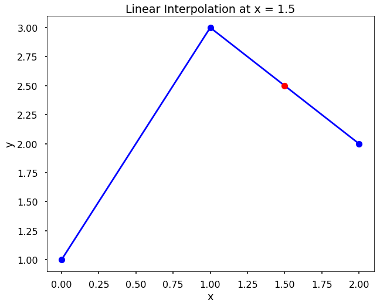

<h1>Лінійна інтерполяція</h1>

У **лінійній інтерполяції** передбачається, що оцінювана точка лежить на прямій, що з'єднує найближчі точки ліворуч і праворуч. Припустимо, без втрати загальності, що точки даних \(x\) розташовані у порядку зростання; тобто \(x_i &lt; x_{i+1}\), і нехай \(x\) буде точкою такою, що \(x_i &lt; x &lt; x_{i+1}\). Тоді лінійна інтерполяція в точці \(x\) дорівнює:
$\(
\hat{y}(x) = y_i + \frac{(y_{i+1} - y_{i})(x - x_{i})}{(x_{i+1} - x_{i})}.\)$

**СПРОБУЙТЕ!** Знайдіть лінійну інтерполяцію в точці \(x=1.5\) на основі даних x = [0, 1, 2], y = [1, 3, 2]. Перевірте результат за допомогою функції *interp1d* з бібліотеки scipy.

Оскільки \(1 &lt; x &lt; 2\), ми використовуємо другу та третю точки даних для обчислення лінійної інтерполяції. Підставляючи відповідні значення, отримуємо
$\(
\hat{y}(x) = y_i + \frac{(y_{i+1} - y_{i})(x - x_{i})}{(x_{i+1} - x_{i})} = 3 + \frac{(2 - 3)(1.5 - 1)}{(2 - 1)} = 2.5
\)$

<pre>from scipy.interpolate import interp1d
import matplotlib.pyplot as plt

plt.style.use('seaborn-poster')
</pre>

<pre>x = [0, 1, 2]
y = [1, 3, 2]

f = interp1d(x, y)
y_hat = f(1.5)
print(y_hat)
</pre>

<pre>2.5
</pre>

<pre>plt.figure(figsize = (10,8))
plt.plot(x, y, '-ob')
plt.plot(1.5, y_hat, 'ro')
plt.title('Лінійна інтерполяція в точці x = 1.5')
plt.xlabel('x')
plt.ylabel('y')
plt.show()
</pre>

