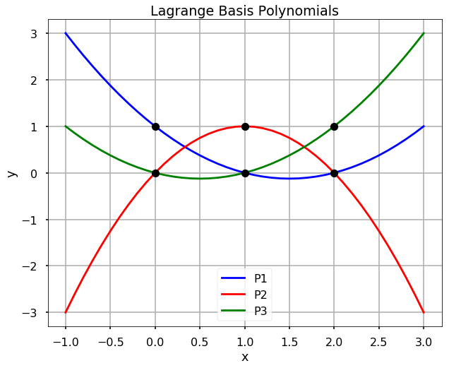
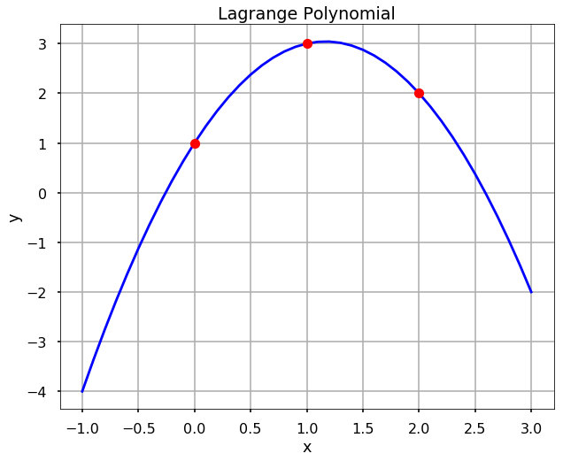

<h1>Інтерполяція поліномом Лагранжа</h1>

Замість того, щоб знаходити кубічні поліноми між послідовними парами точок даних, <strong>інтерполяція поліномом Лагранжа</strong> знаходить єдиний поліном, який проходить через усі точки даних. Цей поліном називається **поліномом Лагранжа**, \(L(x)\), і як інтерполяційна функція, він повинен мати властивість \(L(x_i) = y_i\) для кожної точки в наборі даних. Для обчислення поліномів Лагранжа корисно записати їх як лінійну комбінацію **базисних поліномів Лагранжа**, \(P_i(x)\), де
$\(
P_i(x) = \prod_{j = 1, j\ne i}^n\frac{x - x_j}{x_i - x_j},
\)$

і
$\(
L(x) = \sum_{i = 1}^n y_i P_i(x).
\)$

Тут \(\prod\) означає "добуток" або "перемножити".

Ви помітите, що за побудовою, \(P_i(x)\) має властивість, що \(P_i(x_j) = 1\) коли \(i = j\) і \(P_i(x_j) = 0\) коли \(i \ne j\). Оскільки \(L(x)\) є сумою цих поліномів, ви можете спостерігати, що \(L(x_i) = y_i\) для кожної точки, саме так, як бажано.

<strong>СПРОБУЙТЕ!</strong> Знайдіть базисні поліноми Лагранжа для набору даних <em>x = [0, 1, 2]</em> та <em>y = [1, 3, 2]</em>. Побудуйте графік кожного полінома та перевірте властивість, що \(P_i(x_j) = 1\) коли \(i = j\) і \(P_i(x_j) = 0\) коли \(i \ne j\).

\[\begin{eqnarray*}
P_1(x) &amp;=&amp; \frac{(x - x_2)(x - x_3)}{(x_1-x_2)(x_1-x_3)} = \frac{(x - 1)(x - 2)}{(0-1)(0-2)} = \frac{1}{2}(x^2 - 3x + 2),\\
P_2(x) &amp;=&amp; \frac{(x - x_1)(x - x_3)}{(x_2-x_1)(x_2-x_3)} = \frac{(x - 0)(x - 2)}{(1-0)(1-2)} = -x^2 + 2x,\\
P_3(x) &amp;=&amp; \frac{(x - x_1)(x - x_2)}{(x_3-x_1)(x_3-x_2)} = \frac{(x - 0)(x - 1)}{(2-0)(2-1)} = \frac{1}{2}(x^2 - x).
\end{eqnarray*}\]

<pre>import numpy as np
import numpy.polynomial.polynomial as poly
import matplotlib.pyplot as plt

plt.style.use('seaborn-poster')
</pre>

<pre>x = [0, 1, 2]
y = [1, 3, 2]
P1_coeff = [1,-1.5,.5]
P2_coeff = [0, 2,-1]
P3_coeff = [0,-.5,.5]

# get the polynomial function
P1 = poly.Polynomial(P1_coeff)
P2 = poly.Polynomial(P2_coeff)
P3 = poly.Polynomial(P3_coeff)

x_new = np.arange(-1.0, 3.1, 0.1)

fig = plt.figure(figsize = (10,8))
plt.plot(x_new, P1(x_new), 'b', label = 'P1')
plt.plot(x_new, P2(x_new), 'r', label = 'P2')
plt.plot(x_new, P3(x_new), 'g', label = 'P3')

plt.plot(x, np.ones(len(x)), 'ko', x, np.zeros(len(x)), 'ko')
plt.title('Lagrange Basis Polynomials')
plt.xlabel('x')
plt.ylabel('y')
plt.grid()
plt.legend()
plt.show()
</pre>

<strong>СПРОБУЙТЕ!</strong> Для попереднього прикладу обчисліть та побудуйте графік полінома Лагранжа і перевірте, що він проходить через кожну з точок даних.

<pre>L = P1 + 3*P2 + 2*P3

fig = plt.figure(figsize = (10,8))
plt.plot(x_new, L(x_new), 'b', x, y, 'ro')
plt.title('Lagrange Polynomial')
plt.grid()
plt.xlabel('x')
plt.ylabel('y')
plt.show()
</pre>

<strong>УВАГА!</strong> Інтерполяційні поліноми Лагранжа, визначені за межами області інтерполяції, тобто за межами інтервалу \([x_1,x_n]\), будуть дуже швидко і необмежено зростати за межами цієї області. Це не є бажаною властивістю, оскільки загалом це не відповідає поведінці вихідних даних. Таким чином, інтерполяцію Лагранжа ніколи не слід використовувати для інтерполяції за межами цієї області.

<h2>Використання функції lagrange зі scipy</h2>

Замість того, щоб обчислювати все з нуля, у scipy ми можемо використовувати функцію <em>lagrange</em> безпосередньо для інтерполяції даних. Розглянемо наведений вище приклад.

<pre>from scipy.interpolate import lagrange
</pre>

<pre>f = lagrange(x, y)
</pre>

<pre>fig = plt.figure(figsize = (10,8))
plt.plot(x_new, f(x_new), 'b', x, y, 'ro')
plt.title('Lagrange Polynomial')
plt.grid()
plt.xlabel('x')
plt.ylabel('y')
plt.show()
</pre>

