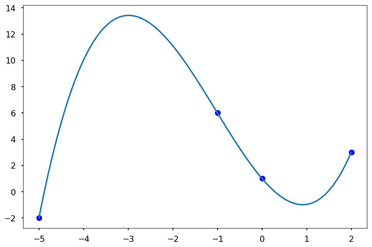

<h1>Поліноміальна інтерполяція Ньютона</h1>

Поліноміальна інтерполяція Ньютона — це ще один популярний спосіб точного апроксимування набору точок даних. Загальний вигляд полінома Ньютона \(n-1\)-го порядку, що проходить через \(n\) точок, такий:

\[ f(x) = a_0 + a_1(x-x_0) + a_2(x-x_0)(x-x_1) + \dots + a_n(x-x_0)(x-x_1)\dots(x-x_n)\]

який можна переписати як:

\[ f(x) = \sum_{i=0}^{n}{a_in_i(x)}\]

де $\( n_i(x) = \prod_{j=0}^{i-1}(x-x_j)\)$

Особливістю полінома Ньютона є те, що коефіцієнти \(a_i\) можна визначити за допомогою дуже простої математичної процедури. Наприклад, оскільки поліном проходить через кожну точку даних, то для точки даних \((x_i, y_i)\) ми матимемо \(f(x_i) = y_i\), отже, ми маємо

\[f(x_0) = a_0 = y_0\]

І \(f(x_1) = a_0 + a_1(x_1-x_0) = y_1\), перегрупувавши його, щоб отримати \(a_1\), ми матимемо:

\[a_1 = \frac{y_1 - y_0}{x_1 - x_0}\]

Тепер, вставивши точки даних \((x_2, y_2)\), ми можемо обчислити \(a_2\), і він має вигляд:

\[a_2 = \frac{\frac{y_2 - y_1}{x_2 - x_1} - \frac{y_1 - y_0}{x_1 - x_0}}{x_2 - x_0}\]

Давайте візьмемо ще одну точку даних \((x_3, y_3)\), щоб обчислити \(a_3\), після вставки точки даних у рівняння, ми отримаємо:

\[a_3 = \frac{\frac{\frac{y_3-y_2}{x_3-x_2} - \frac{y_2 - y_1}{x_2-x_1}}{x_3 - x_1} - \frac{\frac{y_2-y_1}{x_2-x_1}-\frac{y_1 - y_0}{x_1 - x_0}}{x_2-x_0}}{x_3 - x_0}\]

Тепер бачите закономірності? Це називається <strong>розділеними різницями</strong>, якщо ми визначимо:

\[ f[x_1, x_0] = \frac{y_1 - y_0}{x_1 - x_0}\]

\[ f[x_2, x_1, x_0] = \frac{\frac{y_2 - y_1}{x_2 - x_1} - \frac{y_1 - y_0}{x_1 - x_0}}{x_2 - x_0} = \frac{f[x_2,x_1] - f[x_1,x_0]}{x_2-x_1}\]

Продовжуючи записувати це, ми отримаємо наступне ітераційне рівняння:

\[ f[x_k, x_{k-1}, \dots, x_{1}, x_0] = \frac{f[x_k, x_{k-1}, \dots, x_{2}, x_2] - f[x_{k-1}, x_{k-2}, \dots, x_{1}, x_0]}{x_k-x_0}\]

Ми бачимо одну перевагу методу: як тільки коефіцієнти визначені, додавання нових точок даних не змінить вже обчислених, нам потрібно лише продовжувати обчислювати вищі різниці таким же чином. Всю процедуру знаходження цих коефіцієнтів можна узагальнити в таблиці розділених різниць. Розглянемо приклад з використанням 5 точок даних:

\[\begin{split}
\begin{array}{cccccc}
x_0 &amp; y_0 \\
    &amp;     &amp; f[x_1,x_0] \\
x_1 &amp; y_1 &amp;             &amp; f[x_2, x_1,x_0]\\
    &amp;     &amp; f[x_2,x_1]  &amp;              &amp; f[x_3, x_2, x_1,x_0]\\
x_2 &amp; y_2 &amp;             &amp; f[x_3, x_2,x_1] &amp;             &amp; f[x_4, x_3, x_2, x_1,x_0]\\
    &amp;     &amp; f[x_3,x_2]  &amp;              &amp; f[x_4, x_3, x_2, x_1]\\
x_3 &amp; y_3 &amp;             &amp; f[x_4, x_3,x_2]\\
    &amp;     &amp; f[x_4,x_3] \\
x_4 &amp; y_4
\end{array}
\end{split}\]

Кожен елемент у таблиці можна обчислити, використовуючи два попередні елементи (ліворуч). Насправді, ми можемо обчислити кожен елемент і зберегти їх у діагональній матриці, тобто матрицю коефіцієнтів можна записати як:

\[\begin{split}
\begin{array}{cccccc}
y_0 &amp; f[x_1,x_0] &amp; f[x_2, x_1,x_0] &amp; f[x_3, x_2, x_1,x_0] &amp; f[x_4, x_3, x_2, x_1,x_0]\\
y_1 &amp; f[x_2,x_1] &amp; f[x_3, x_2,x_1] &amp; f[x_4, x_3, x_2, x_1] &amp; 0\\
y_2 &amp; f[x_3,x_2] &amp; f[x_4, x_3,x_2] &amp; 0          &amp; 0 \\
y_3 &amp; f[x_4,x_3] &amp; 0 &amp; 0 &amp; 0            \\
y_4 &amp; 0 &amp; 0 &amp; 0  &amp; 0  
\end{array}
\end{split}\]

Зауважте, що перший рядок у матриці — це насправді всі коефіцієнти, які нам потрібні, тобто \(a_0, a_1, a_2, a_3, a_4\). Давайте розглянемо приклад, як це можна зробити.

<strong>СПРОБУЙТЕ!</strong> Обчисліть таблицю розділених різниць для x = [-5, -1, 0, 2], y = [-2, 6, 1, 3].

<pre>import numpy as np
import matplotlib.pyplot as plt

plt.style.use('seaborn-poster')

%matplotlib inline
</pre>

<pre>def divided_diff(x, y):
    '''
    функція для обчислення таблиці
    розділених різниць
    '''
    n = len(y)
    coef = np.zeros([n, n])
    # перший стовпець - це y
    coef[:,0] = y
    
    for j in range(1,n):
        for i in range(n-j):
            coef[i][j] = \
           (coef[i+1][j-1] - coef[i][j-1]) / (x[i+j]-x[i])
            
    return coef

def newton_poly(coef, x_data, x):
    '''
    обчислити поліном Ньютона 
    в точці x
    '''
    n = len(x_data) - 1 
    p = coef[n]
    for k in range(1,n+1):
        p = coef[n-k] + (x -x_data[n-k])*p
    return p
</pre>

<pre>x = np.array([-5, -1, 0, 2])
y = np.array([-2, 6, 1, 3])
# get the divided difference coef
a_s = divided_diff(x, y)[0, :]

# evaluate on new data points
x_new = np.arange(-5, 2.1, .1)
y_new = newton_poly(a_s, x, x_new)

plt.figure(figsize = (12, 8))
plt.plot(x, y, 'bo')
plt.plot(x_new, y_new)
</pre>

<pre>[&lt;matplotlib.lines.Line2D at 0x11bd4e630&gt;]
</pre>

Ми бачимо, що поліном Ньютона проходить через усі точки даних і апроксимує їх.

