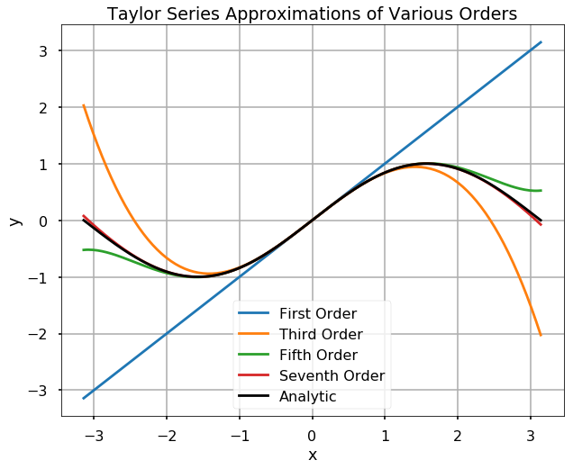
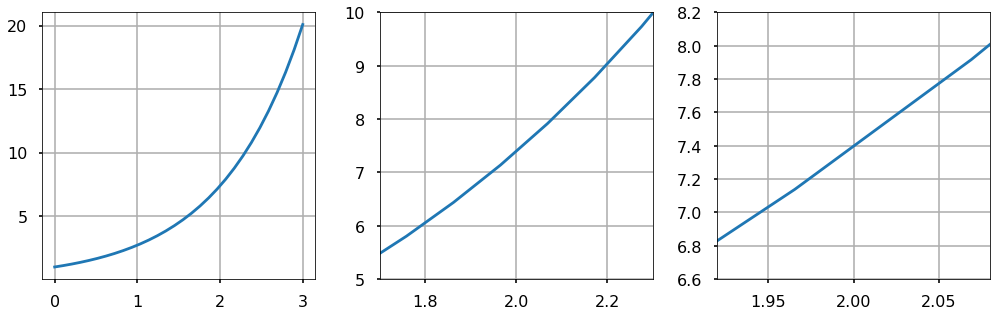

<h1>Апроксимації за допомогою рядів Тейлора</h1>

Очевидно, що виражати функції як нескінченні суми не є корисним, оскільки ми навіть не можемо обчислити їх таким чином. Однак часто корисно апроксимувати функції за допомогою \(\textbf{\)N-го\( порядку наближення ряду Тейлора}\) функції, що є усіченням її розкладу Тейлора при деякому \(n = N\). Ця техніка особливо потужна, коли існує точка, навколо якої ми маємо знання про функцію для всіх її похідних. Наприклад, якщо ми візьмемо розклад Тейлора \(e^x\) навколо \(a = 0\), тоді \(f^{(n)}(a) = 1\) для всіх \(n\), нам навіть не потрібно обчислювати похідні в розкладі Тейлора, щоб апроксимувати \(e^x\)!

<strong>СПРОБУЙТЕ!</strong> Використайте Python для побудови графіка функції синуса разом з апроксимаціями рядами Тейлора першого, третього, п'ятого та сьомого порядків. Зауважте, що це відповідає нульовому-третьому порядку у формулі, наведеній раніше.

<pre>import numpy as np
import matplotlib.pyplot as plt

plt.style.use('seaborn-poster')
</pre>

<pre>x = np.linspace(-np.pi, np.pi, 200)
y = np.zeros(len(x))

labels = ['Перший порядок', 'Третій порядок', 'П'ятий порядок', 'Сьомий порядок']

plt.figure(figsize = (10,8))
for n, label in zip(range(4), labels):
    y = y + ((-1)**n * (x)**(2*n+1)) / np.math.factorial(2*n+1)
    plt.plot(x,y, label = label)

plt.plot(x, np.sin(x), 'k', label = 'Аналітична')
plt.grid()
plt.title('Апроксимації рядами Тейлора різних порядків')
plt.xlabel('x')
plt.ylabel('y')
plt.legend()
plt.show()
</pre>

Як бачите, апроксимація швидко наближається до аналітичної функції, навіть для \(x\), що не знаходиться близько до \(a=0\). Зауважте, що у наведеному вище коді ми також використали нову функцію - <em>zip</em>, яка дозволяє нам перебирати два параметри <em>range(4)</em> та <em>labels</em> і використовувати їх у нашому графіку.

<strong>СПРОБУЙТЕ!</strong> Обчисліть апроксимацію ряду Тейлора сьомого порядку для \(sin(x)\) навколо \(a=0\) в точці \(x=\pi/2\). Порівняйте отримане значення з правильним значенням, 1.

<pre>x = np.pi/2
y = 0

for n in range(4):
    y = y + ((-1)**n * (x)**(2*n+1)) / np.math.factorial(2*n+1)
    
print(y)
</pre>

<pre>0.9998431013994987
</pre>

Апроксимація ряду Тейлора сьомого порядку дуже близька до теоретичного значення функції, навіть якщо вона обчислюється далеко від точки, навколо якої був обчислений ряд Тейлора (тобто \(x = \pi/2\) та \(a = 0\)).

Найпоширенішою апроксимацією ряду Тейлора є апроксимація першого порядку, або <strong>лінійна апроксимація</strong>. Інтуїтивно, для "гладких" функцій лінійна апроксимація функції навколо точки \(a\) може бути зроблена настільки точною, наскільки ви бажаєте, за умови, що ви залишаєтеся достатньо близько до \(a\). Іншими словами, "гладкі" функції все більше і більше схожі на пряму, чим більше ви наближаєтеся до будь-якої точки. Цей факт зображено на наступному малюнку, де ми будуємо послідовні рівні масштабування гладкої функції, щоб проілюструвати лінійну природу функцій локально. Лінійні апроксимації є корисними інструментами при аналізі складних функцій локально.

<pre>x = np.linspace(0, 3, 30)
y = np.exp(x)

plt.figure(figsize = (14, 4.5))
plt.subplot(1, 3, 1)
plt.plot(x, y)
plt.grid()
plt.subplot(1, 3, 2)
plt.plot(x, y)
plt.grid()
plt.xlim(1.7, 2.3)
plt.ylim(5, 10)
plt.subplot(1, 3, 3)
plt.plot(x, y)
plt.grid()
plt.xlim(1.92, 2.08)
plt.ylim(6.6, 8.2)
plt.tight_layout()
plt.show()
</pre>

<strong>СПРОБУЙТЕ!</strong> Візьміть лінійну апроксимацію для \(e^x\) навколо точки \(a = 0\). Використайте лінійну апроксимацію для \(e^x\), щоб апроксимувати значення \(e^1\) та \(e^{0.01}\). Використайте функцію Numpy <em>exp</em> для обчислення <em>exp(1)</em> та <em>exp(0.01)</em> для порівняння.

Лінійна апроксимація \(e^x\) навколо \(a = 0\) дорівнює \(1 + x\).

Функція Numpy <em>exp</em> дає наступне:

<pre>np.exp(1)
</pre>

<pre>2.718281828459045
</pre>

<pre>np.exp(0.01)
</pre>

<pre>1.010050167084168
</pre>

Лінійна апроксимація \(e^1\) дорівнює 2, що є неточним, а лінійна апроксимація \(e^{0.01}\) дорівнює 1.01, що є дуже хорошим результатом. Цей приклад ілюструє, як лінійна апроксимація наближається до функцій поблизу точки, навколо якої береться апроксимація.

