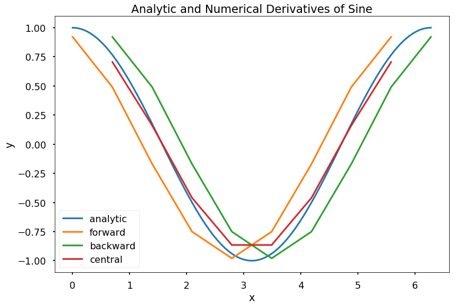
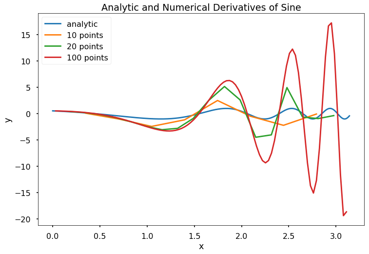
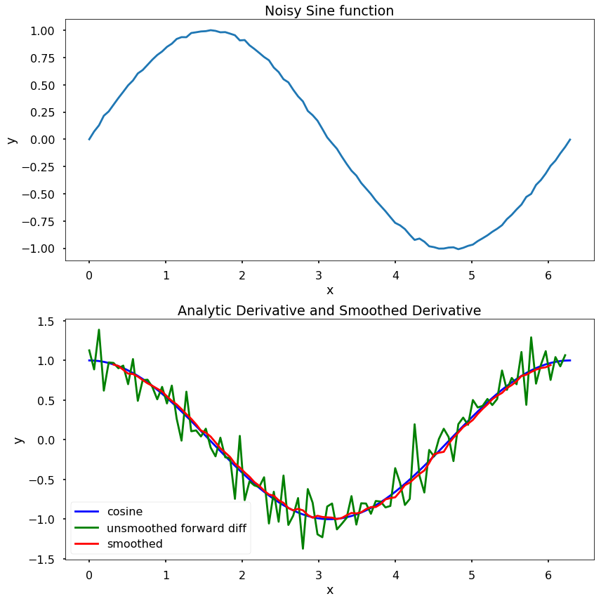

<h1>Підсумок</h1>
<ol>
<li>
Оскільки явне диференціювання функцій іноді є громіздким для інженерних застосувань, чисельні підходи можуть бути кращими.
</li>
<li>
Чисельне наближення похідних можна виконати за допомогою сітки, на якій похідна апроксимується скінченними різницями.
</li>
<li>
Скінченні різниці апроксимують похідну співвідношеннями різниць значень функції на малих інтервалах.
</li>
<li>
Схеми скінченних різниць мають різні порядки апроксимації залежно від використаного методу.
</li>
<li>
Існують проблеми зі скінченними різницями для апроксимації похідних, коли дані є зашумленими.
</li>
</ol>

<h1>Задачі</h1>
<ol>
<li>
Напишіть функцію \(my\_der\_calc(f, a, b, N, option)\), з виходом у вигляді \([df, X]\), де \(f\) є об'єктом функції, \(a\) та \(b\) є скалярами такими, що a &lt; b, \(N\) є цілим числом, більшим за 10, а \(option)\) є рядком \(forward\), \(backward\), або \(central\). Нехай \(x\) буде масивом, що починається з \(a\), закінчується на \(b\), що містить \(N\) рівномірно розташованих елементів, і нехай \(y\) буде масивом \(f(x)\). Вихідний аргумент, \(df\), має бути чисельними похідними, обчисленими для \(x\) та \(y\) згідно з методом, визначеним вхідним аргументом, \(option\). Вихідний аргумент \(X\) має бути масивом такого ж розміру, як \(df\), що містить точки в \(x\), для яких \(df\) є дійсним. Зокрема, метод прямої різниці "втрачає" останню точку, метод зворотної різниці втрачає першу точку, а метод центральної різниці втрачає першу та останню точки.
</li>
<li>
Напишіть функцію \(my\_num\_diff(f, a, b, n, option)\), з виходом у вигляді \([df, X]\), де \(f\) є об'єктом функції. Функція \(my\_num\_diff\) має обчислити похідну від \(f\) чисельно для \(n\) рівномірно розташованих точок, що починаються з \(a\) і закінчуються на \(b\) згідно з методом, визначеним \(option\). Вхідний аргумент \(option\) є одним з наступних рядків: ‘forward`, ‘backward`, ‘central`. Зауважте, що для прямого та зворотного методів вихідний аргумент, \(dy\), має бути \((n-1)\) 1D масивом, а для методу центральної різниці \(dy\) має бути \((n-2)\) 1D масивом. Функція також має виводити вектор \(X\) такого ж розміру, як \(dy\), і позначати значення x, для яких \(dy\) є дійсним.
</li>
</ol>

Приклади використання:

<pre>x = np.linspace(0, 2*np.pi, 100)
f = lambda x: np.sin(x)
[dyf, Xf] = my_num_diff(f, 0, 2*np.pi, 10, 'forward')
[dyb, Xb] = my_num_diff(f, 0, 2*np.pi, 10, 'backward')
[dyc, Xc] = my_num_diff(f, 0, 2*np.pi, 10, 'central')
plt.figure(figsize = (12, 8))
plt.plot(x, np.cos(x), label = 'аналітична')
plt.plot(Xf, dyf, label = 'пряма')
plt.plot(Xb, dyb, label = 'зворотна')
plt.plot(Xc, dyc, label = 'центральна')
plt.legend()
plt.title('Аналітичні та чисельні похідні синуса')
plt.xlabel('x')
plt.ylabel('y')
plt.show()
</pre>

<pre>x = np.linspace(0, np.pi, 1000)
f = lambda x: np.sin(np.exp(x))
[dy10, X10] = my_num_diff(f, 0, np.pi, 10, 'central')
[dy20, X20] = my_num_diff(f, 0, np.pi, 20, 'central')
[dy100, X100] = my_num_diff(f, 0, np.pi, 100, 'central')
plt.figure(figsize = (12, 8))
plt.plot(x, np.cos(np.exp(x)), label = 'аналітична')
plt.plot(X10, dy10, label = '10 точок')
plt.plot(X20, dy20, label = '20 точок')
plt.plot(X100, dy100, label = '100 точок')
plt.legend()
plt.title('Аналітичні та чисельні похідні синуса')
plt.xlabel('x')
plt.ylabel('y')
plt.show()
</pre>

<ol>
<li>
Напишіть функцію \(my\_num\_diff\_w\_smoothing(x, y, n)\), з виходом \([dy, X], \)де \(x\) та \(y\) є 1D масивами numpy однакової довжини, а \(n\) є строго позитивним скаляром. Функція спочатку має створити вектор "згладжених" точок даних \(y\), де \(y\_smooth[i] = np.mean(y[i-n:i+n])\). Потім функція має обчислити \(dy\), похідну згладженого \(y\)-вектора, використовуючи метод центральної різниці. Функція також має виводити 1D масив \(X\) такого ж розміру, як \(dy\), і позначати значення x, для яких \(dy\) є дійсним.
</li>
</ol>

Припустімо, що дані, що містяться в \(x\), розташовані у зростаючому порядку без дублікатів. Однак можливо, що елементи \(x\) не будуть рівномірно розташовані. Зауважте, що вихідний \(dy\) матиме на \(2n + 2\) точок менше, ніж \(y\). Припустімо, що довжина \(y\) значно більша за \(2n + 2\).

Приклади використання:

<pre>x = np.linspace(0, 2*np.pi, 100)
y = np.sin(x) + np.random.randn(len(x))/100
[dy, X] = my_num_diff_w_smoothing(x, y, 4)
plt.figure(figsize = (12, 12))
plt.subplot(211)
plt.plot(x, y)
plt.title('Зашумлена функція синуса')
plt.xlabel('x')
plt.ylabel('y')
plt.subplot(212)
plt.plot(x, np.cos(x), 'b', label = 'косинус')
plt.plot(x[:-1], (y[1:] - y[:-1])/(x[1]-x[0]), 'g', \
    label = 'незгладжена пряма різниця')
plt.plot(X, dy, 'r', label = 'згладжена')
plt.title('Аналітична та згладжена похідна')
plt.xlabel('x')
plt.ylabel('y')
plt.legend()
plt.tight_layout()
plt.show()
</pre>

<ol>
<li>
Використайте ряд Тейлора, щоб показати наступні апроксимації та їх точність.
$$
</li>
</ol>

\[\begin{eqnarray*}
f''(x_j) &amp;=&amp; \frac{-f(x_{j+3})+4f(x_{j+2}) - 5f(x_{j+1}) + 2f(x_j)}{h^2} + O(h^2),\\
f'''(x_j) &amp;=&amp; \frac{f(x_{j+3})-3f(x_{j+2}) +3f(x_{j+1}) - f(x_j)}{h^3} + O(h).
\end{eqnarray*}\]

$$

