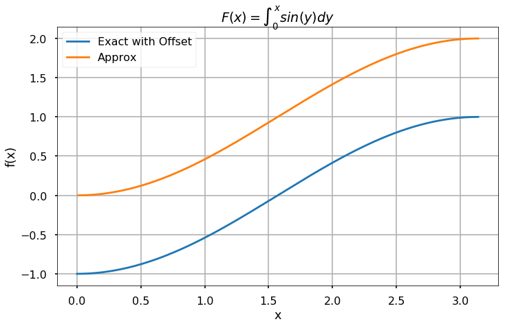

<h1>Обчислення інтегралів у Python</h1>

Підпакет \(scipy.integrate\) має кілька функцій для обчислення інтегралів. Функція \(trapz\) приймає як вхідні аргументи масив значень функції \(f\), обчислених на числовій сітці \(x\).

<strong>СПРОБУЙТЕ!</strong> Використайте функцію \(trapz\) для апроксимації \(\int_{0}^{\pi}\text{sin}(x)dx\) для 11 рівновіддалених точок на всьому інтервалі. Порівняйте це значення з тим, що було обчислено в попередньому прикладі за допомогою правила трапецій.

<pre>import numpy as np
from scipy.integrate import trapz

a = 0
b = np.pi
n = 11
h = (b - a) / (n - 1)
x = np.linspace(a, b, n)
f = np.sin(x)

I_trapz = trapz(f,x)
I_trap = (h/2)*(f[0] + 2 * sum(f[1:n-1]) + f[n-1])

print(I_trapz)
print(I_trap)
</pre>

<pre>1.9835235375094542
1.9835235375094546
</pre>

Іноді нам потрібно знати наближений кумулятивний (накопичувальний) інтеграл. Тобто, ми хочемо знайти \(F(X) = \int_{x_0}^X f(x) dx\). Для цієї мети корисно використовувати функцію \(cumtrapz\), яка приймає ті ж вхідні аргументи, що й \(trapz\).

<strong>СПРОБУЙТЕ!</strong> Використайте функцію \(cumtrapz\) для апроксимації кумулятивного інтеграла \(f(x) = \text{sin}(x)\) від \(0\) до \(\pi\) з кроком дискретизації 0.01. Точний розв'язок цього інтеграла — \(F(x) = 1 - \text{cos}(x)\). Побудуйте графіки результатів.

<pre>from scipy.integrate import cumtrapz
import matplotlib.pyplot as plt

%matplotlib inline
plt.style.use('seaborn-poster')

x = np.arange(0, np.pi, 0.01)
F_exact = -np.cos(x)
F_approx = cumtrapz(np.sin(x), x)

plt.figure(figsize = (10,6))
plt.plot(x, F_exact)
plt.plot(x[1::], F_approx)
plt.grid()
plt.tight_layout()
plt.title('$F(x) = \int_0^{x} sin(y) dy$')
plt.xlabel('x')
plt.ylabel('f(x)')
plt.legend(['Exact with Offset', 'Approx'])
plt.show()
</pre>

Функція \(quad(f,a,b)\) використовує іншу схему чисельного інтегрування для апроксимації інтегралів. \(quad\) інтегрує функцію, визначену об'єктом-функцією \(f\), від \(a\) до \(b\).

<strong>СПРОБУЙТЕ!</strong> Використайте функцію \(integrate.quad\) для обчислення \(\int_{0}^{\pi} \text{sin}(x)dx\). Порівняйте вашу відповідь з правильною відповіддю 2.

<pre>from scipy.integrate import quad

I_quad, est_err_quad = \
          quad(np.sin, 0, np.pi)
print(I_quad)
err_quad = 2 - I_quad
print(est_err_quad, err_quad)
</pre>

<pre>2.0
2.220446049250313e-14 0.0
</pre>
