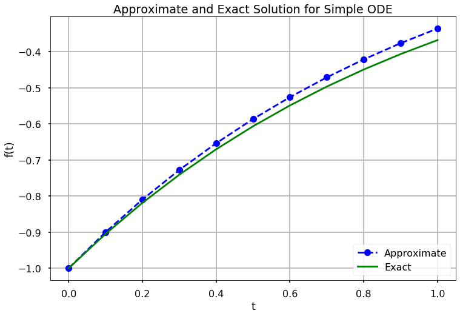
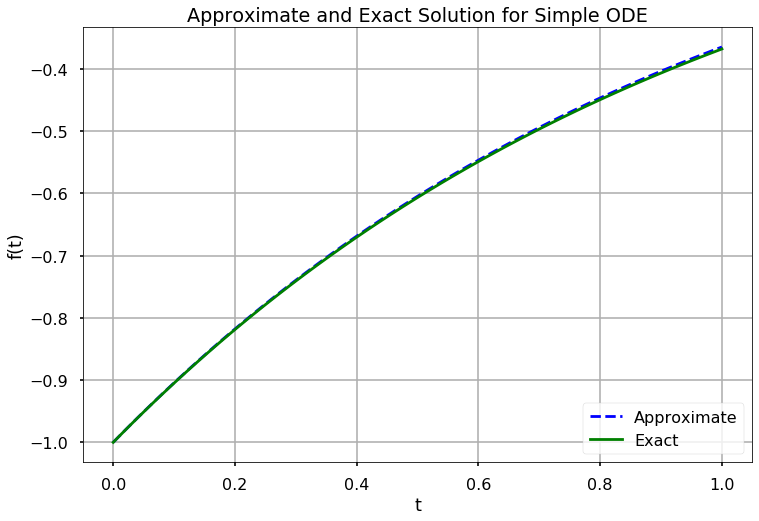

```html
<h1>Метод Ейлера<a href="#the-euler-method" title="Permalink to this headline"></a></h1>
<p>Нехай <span>\(\frac{dS(t)}{dt} = F(t,S(t))\)</span> є явно визначеним звичайним диференціальним рівнянням (ЗДР) першого порядку. Тобто, <span>\(F\)</span> — це функція, яка повертає похідну, або зміну, стану для заданого часу та значення стану. Також, нехай <span>\(t\)</span> буде числовою сіткою на інтервалі <span>\([t_0, t_f]\)</span> з кроком <span>\(h\)</span>. Без втрати загальності, припустимо, що <span>\(t_0 = 0\)</span>, і що <span>\(t_f = Nh\)</span> для деякого додатного цілого числа, <span>\(N\)</span>.</p>
<p>Лінійне наближення <span>\(S(t)\)</span> навколо <span>\(t_j\)</span> в точці <span>\(t_{j+1}\)</span> є</p>

\[
S(t_{j+1}) = S(t_j) + (t_{j+1} - t_j)\frac{dS(t_j)}{dt},
\]
<p>що також можна записати як</p>

\[
S(t_{j+1}) = S(t_j) + hF(t_j, S(t_j)).
\]
<p>Ця формула називається <strong>Явною формулою Ейлера</strong>, і вона дозволяє нам обчислити наближення для стану в точці <span>\(S(t_{j+1})\)</span> за умови відомого стану в точці <span>\(S(t_j)\)</span>. Починаючи з заданого початкового значення <span>\(S_0 = S(t_0)\)</span>, ми можемо використовувати цю формулу для інтегрування станів до <span>\(S(t_f)\)</span>; ці значення <span>\(S(t)\)</span> є наближенням розв'язку диференціального рівняння. Явна формула Ейлера є найпростішим та найбільш інтуїтивно зрозумілим методом для розв'язання задач з початковими умовами. У будь-якому стані <span>\((t_j, S(t_j))\)</span> вона використовує <span>\(F\)</span> в цьому стані, щоб "вказати" на наступний стан, а потім рухається в цьому напрямку на відстань <span>\(h\)</span>. Хоча існують більш складні та точні методи для розв'язання цих задач, усі вони мають однакову фундаментальну структуру. Таким чином, ми перелічимо кроки для розв'язання задачі з початковими умовами за допомогою явної формули Ейлера.</p>

<p><strong>ЩО ВІДБУВАЄТЬСЯ?</strong> Припустимо, нам дана функція <span>\(F(t, S(t))\)</span>, яка обчислює <span>\(\frac{dS(t)}{dt}\)</span>, числова сітка <span>\(t\)</span> на інтервалі <span>\([t_0, t_f]\)</span>, та початкове значення стану <span>\(S_0 = S(t_0)\)</span>. Ми можемо обчислити <span>\(S(t_j)\)</span> для кожного <span>\(t_j\)</span> в <span>\(t\)</span> за допомогою наступних кроків.</p>
<ol>
<li><p>Зберегти <span>\(S_0 = S(t_0)\)</span> у масиві, <span>\(S\)</span>.</p></li>
<li><p>Обчислити <span>\(S(t_1) = S_0 + hF(t_0, S_0)\)</span>.</p></li>
<li><p>Зберегти <span>\(S_1 = S(t_1)\)</span> у <span>\(S\)</span>.</p></li>
<li><p>Обчислити <span>\(S(t_2) = S_1 + hF(t_1, S_1)\)</span>.</p></li>
<li><p>Зберегти <span>\(S_2 = S(t_1)\)</span> у <span>\(S\)</span>.</p></li>
<li><p><span>\(\cdots\)</span></p></li>
<li><p>Обчислити <span>\(S(t_f) = S_{f-1} + hF(t_{f-1}, S_{f-1})\)</span>.</p></li>
<li><p>Зберегти <span>\(S_f = S(t_f)\)</span> у <span>\(S\)</span>.</p></li>
<li><p><span>\(S\)</span> є наближенням розв'язку задачі з початковими умовами.</p></li>
</ol>
<p>Коли використовується метод з такою структурою, ми кажемо, що метод <strong>інтегрує</strong> розв'язок ЗДР.</p>
<p><strong>СПРОБУЙТЕ!</strong> Диференціальне рівняння <span>\(\frac{df(t)}{dt} = e^{-t}\)</span> з початковою умовою <span>\(f_0 = -1\)</span> має точний розв'язок <span>\(f(t) = -e^{-t}\)</span>. Знайдіть наближений розв'язок цієї задачі з початковими умовами на проміжку від 0 до 1 з кроком 0.1, використовуючи явну формулу Ейлера. Побудуйте графік різниці між наближеним та точним розв'язками.</p>


<pre><span></span><span>import</span> <span>numpy</span> <span>as</span> <span>np</span>
<span>import</span> <span>matplotlib.pyplot</span> <span>as</span> <span>plt</span>

<span>plt</span><span>.</span><span>style</span><span>.</span><span>use</span><span>(</span><span>'seaborn-poster'</span><span>)</span>
<span>%</span><span>matplotlib</span> inline

<span># Визначення параметрів</span>
<span>f</span> <span>=</span> <span>lambda</span> <span>t</span><span>,</span> <span>s</span><span>:</span> <span>np</span><span>.</span><span>exp</span><span>(</span><span>-</span><span>t</span><span>)</span> <span># ЗДР</span>
<span>h</span> <span>=</span> <span>0.1</span> <span># Розмір кроку</span>
<span>t</span> <span>=</span> <span>np</span><span>.</span><span>arange</span><span>(</span><span>0</span><span>,</span> <span>1</span> <span>+</span> <span>h</span><span>,</span> <span>h</span><span>)</span> <span># Числова сітка</span>
<span>s0</span> <span>=</span> <span>-</span><span>1</span> <span># Початкова умова</span>

<span># Явний метод Ейлера</span>
<span>s</span> <span>=</span> <span>np</span><span>.</span><span>zeros</span><span>(</span><span>len</span><span>(</span><span>t</span><span>))</span>
<span>s</span><span>[</span><span>0</span><span>]</span> <span>=</span> <span>s0</span>

<span>for</span> <span>i</span> <span>in</span> <span>range</span><span>(</span><span>0</span><span>,</span> <span>len</span><span>(</span><span>t</span><span>)</span> <span>-</span> <span>1</span><span>):</span>
    <span>s</span><span>[</span><span>i</span> <span>+</span> <span>1</span><span>]</span> <span>=</span> <span>s</span><span>[</span><span>i</span><span>]</span> <span>+</span> <span>h</span><span>*</span><span>f</span><span>(</span><span>t</span><span>[</span><span>i</span><span>],</span> <span>s</span><span>[</span><span>i</span><span>])</span>

<span>plt</span><span>.</span><span>figure</span><span>(</span><span>figsize</span> <span>=</span> <span>(</span><span>12</span><span>,</span> <span>8</span><span>))</span>
<span>plt</span><span>.</span><span>plot</span><span>(</span><span>t</span><span>,</span> <span>s</span><span>,</span> <span>'bo--'</span><span>,</span> <span>label</span><span>=</span><span>'Наближений'</span><span>)</span>
<span>plt</span><span>.</span><span>plot</span><span>(</span><span>t</span><span>,</span> <span>-</span><span>np</span><span>.</span><span>exp</span><span>(</span><span>-</span><span>t</span><span>),</span> <span>'g'</span><span>,</span> <span>label</span><span>=</span><span>'Точний'</span><span>)</span>
<span>plt</span><span>.</span><span>title</span><span>(</span><span>'Наближений та точний розв\'язки </span><span>\</span>
<span>для простого ЗДР'</span><span>)</span>
<span>plt</span><span>.</span><span>xlabel</span><span>(</span><span>'t'</span><span>)</span>
<span>plt</span><span>.</span><span>ylabel</span><span>(</span><span>'f(t)'</span><span>)</span>
<span>plt</span><span>.</span><span>grid</span><span>()</span>
<span>plt</span><span>.</span><span>legend</span><span>(</span><span>loc</span><span>=</span><span>'lower right'</span><span>)</span>
<span>plt</span><span>.</span><span>show</span><span>()</span>
</pre>





<p>На наведеному вище графіку ми бачимо, що кожна точка є одним наближенням, що базується на попередній точці лінійним чином. Починаючи з початкового значення, ми можемо в кінцевому підсумку отримати наближення розв'язку на числовій сітці. Якщо ми повторимо процес для <span>\(h = 0.01\)</span>, ми отримаємо краще наближення розв'язку:</p>


<pre><span></span><span>h</span> <span>=</span> <span>0.01</span> <span># Розмір кроку</span>
<span>t</span> <span>=</span> <span>np</span><span>.</span><span>arange</span><span>(</span><span>0</span><span>,</span> <span>1</span> <span>+</span> <span>h</span><span>,</span> <span>h</span><span>)</span> <span># Числова сітка</span>
<span>s0</span> <span>=</span> <span>-</span><span>1</span> <span># Початкова умова</span>

<span># Явний метод Ейлера</span>
<span>s</span> <span>=</span> <span>np</span><span>.</span><span>zeros</span><span>(</span><span>len</span><span>(</span><span>t</span><span>))</span>
<span>s</span><span>[</span><span>0</span><span>]</span> <span>=</span> <span>s0</span>

<span>for</span> <span>i</span> <span>in</span> <span>range</span><span>(</span><span>0</span><span>,</span> <span>len</span><span>(</span><span>t</span><span>)</span> <span>-</span> <span>1</span><span>):</span>
    <span>s</span><span>[</span><span>i</span> <span>+</span> <span>1</span><span>]</span> <span>=</span> <span>s</span><span>[</span><span>i</span><span>]</span> <span>+</span> <span>h</span><span>*</span><span>f</span><span>(</span><span>t</span><span>[</span><span>i</span><span>],</span> <span>s</span><span>[</span><span>i</span><span>])</span>

<span>plt</span><span>.</span><span>figure</span><span>(</span><span>figsize</span> <span>=</span> <span>(</span><span>12</span><span>,</span> <span>8</span><span>))</span>
<span>plt</span><span>.</span><span>plot</span><span>(</span><span>t</span><span>,</span> <span>s</span><span>,</span> <span>'b--'</span><span>,</span> <span>label</span><span>=</span><span>'Наближений'</span><span>)</span>
<span>plt</span><span>.</span><span>plot</span><span>(</span><span>t</span><span>,</span> <span>-</span><span>np</span><span>.</span><span>exp</span><span>(</span><span>-</span><span>t</span><span>),</span> <span>'g'</span><span>,</span> <span>label</span><span>=</span><span>'Точний'</span><span>)</span>
<span>plt</span><span>.</span><span>title</span><span>(</span><span>'Наближений та точний розв\'язки </span><span>\</span>
<span>для простого ЗДР'</span><span>)</span>
<span>plt</span><span>.</span><span>xlabel</span><span>(</span><span>'t'</span><span>)</span>
<span>plt</span><span>.</span><span>ylabel</span><span>(</span><span>'f(t)'</span><span>)</span>
<span>plt</span><span>.</span><span>grid</span><span>()</span>
<span>plt</span><span>.</span><span>legend</span><span>(</span><span>loc</span><span>=</span><span>'lower right'</span><span>)</span>
<span>plt</span><span>.</span><span>show</span><span>()</span>
</pre>





<p>Явна формула Ейлера називається "явною", оскільки для обчислення стану в точці <span>\(t_{j+1}\)</span> вона вимагає інформації лише в точці <span>\(t_j\)</span>. Тобто, <span>\(S(t_{j+1})\)</span> можна записати явно через значення, які ми маємо (тобто <span>\(t_j\)</span> та <span>\(S(t_j)\)</span>). <strong>Неявну формулу Ейлера</strong> можна отримати, взявши лінійне наближення <span>\(S(t)\)</span> навколо <span>\(t_{j+1}\)</span> та обчисливши його в точці <span>\(t_j\)</span>:</p>

\[
S(t_{j+1}) = S(t_j) + hF(t_{j+1}, S(t_{j+1})).
\]
<p>Ця формула є особливою, оскільки для обчислення <span>\(S(t_{j+1})\)</span> вона вимагає знання <span>\(S(t_{j+1})\)</span>! Однак, іноді ми <em>можемо</em> використовувати цю формулу для наближеного розв'язання задач з початковими умовами. Перш ніж ми детально розглянемо, як розв'язувати ці задачі за допомогою неявної формули Ейлера, ми наведемо ще одну неявну формулу, яка називається <strong>формулою трапецій</strong>, і є середнім арифметичним явної та неявної формул Ейлера:</p>

\[
S(t_{j+1}) = S(t_j) + \frac{h}{2}(F(t_j, S(t_j)) + F(t_{j+1}, S(t_{j+1}))).
\]
<p>Щоб проілюструвати, як розв'язувати ці неявні схеми, розглянемо знову рівняння маятника, яке було зведено до першого порядку.</p>

\[\begin{split}
\frac{dS(t)}{dt} =\left[\begin{array}{cc}
0 &amp; 1 \\
-\frac{g}{l} &amp; 0
\end{array}\right]S(t)
\end{split}\]
<p>Для цього рівняння,</p>

\[\begin{split}
F(t_j, S(t_j)) =\left[\begin{array}{cc}
0 &amp; 1 \\
-\frac{g}{l} &amp; 0
\end{array}\right]S(t_j).
\end{split}\]
<p>Якщо ми підставимо цей вираз у явну формулу Ейлера, ми отримаємо наступне рівняння:</p>

\[\begin{split}
S(t_{j+1}) = S(t_j) + h \left[\begin{array}{cc}
0 &amp; 1 \\
-\frac{g}{l} &amp; 0
\end{array}\right]S(t_j) = \left[\begin{array}{cc}
1 &amp; 0 \\
0 &amp; 1
\end{array}\right]S(t_j) + h\left[\begin{array}{cc}
0 &amp; 1 \\
-\frac{g}{l} &amp; 0
\end{array}\right]S(t_j)= \left[\begin{array}{cc}
1 &amp; h \\
-\frac{gh}{l} &amp; 1
\end{array}\right]S(t_j)
\end{split}\]
<p>Аналогічно, ми можемо підставити той самий вираз у неявну формулу Ейлера, щоб отримати</p>

\[\begin{split}
\left[\begin{array}{cc}
1 &amp; -h \\
\frac{gh}{l} &amp; 1
\end{array}\right]S(t_{j+1}) = S(t_j),
\end{split}\]
<p>і у формулу трапецій, щоб отримати</p>

\[\begin{split}
\left[\begin{array}{cc}
1 &amp; -\frac{h}{2} \\
\frac{gh}{2l} &amp; 1
\end{array}\right]S(t_{j+1}) = \left[\begin{array}{cc}
1 &amp; \frac{h}{2} \\
-\frac{gh}{2l} &amp; 1
\end{array}\right]S(t_j).
\end{split}\]
<p>Після деяких перетворень ці рівняння стають, відповідно,</p>

\[\begin{split}
\begin{eqnarray*}
&amp;&amp; S(t_{j+1}) = \left[\begin{array}{cc}
1 &amp; -h \\
\frac{gh}{l} &amp; 1
\end{array}\right]^{-1} S(t_j),\\
&amp;&amp; S(t_{j+1}) = \left[\begin{array}{cc}
1 &amp; -\frac{h}{2} \\
\frac{gh}{2l} &amp; 1
\end{array}\right]^{-1}\left[\begin{array}{cc}
1 &amp; \frac{h}{2} \\
-\frac{gh}{2l} &amp; 1
\end{array}\right]S(t_j).
\end{eqnarray*}
\end{split}\]
<p>Ці рівняння дозволяють нам розв'язувати задачу з початковими умовами, оскільки в кожному стані <span>\(S(t_j)\)</span> ми можемо обчислити наступний стан в <span>\(S(t_{j+1})\)</span>. Загалом, це можливо зробити, коли ЗДР є лінійним.</p>
```
