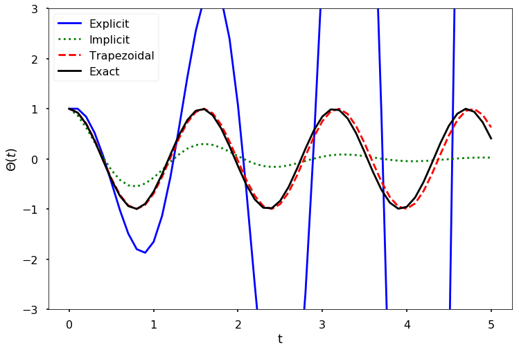

```html
<h1>Чисельна похибка та нестійкість<a href="#numerical-error-and-instability" title="Permalink to this headline"></a></h1>
<p>Існують дві основні проблеми, які слід враховувати щодо схем інтегрування для ОДР: <strong>точність</strong> та <strong>стійкість</strong>. Точність означає здатність схеми наближатися до точного розв'язку, який зазвичай невідомий, як функція від розміру кроку <span>\(h\)</span>. У попередніх розділах точність позначалася як <span>\(O(h^p)\)</span>. Таке ж позначення використовується і при розв'язанні ОДР. Стійкість схеми інтегрування — це її здатність утримувати похибку від зростання під час інтегрування в часі. Якщо похибка не зростає, схема є стійкою; в іншому випадку вона нестійка. Деякі схеми інтегрування є стійкими для певних значень <span>\(h\)</span> і нестійкими для інших; такі схеми інтегрування також називають нестійкими.</p>
<p>Щоб проілюструвати проблеми стійкості, ми розв'яжемо рівняння маятника чисельно, використовуючи явну схему Ейлера, неявну схему Ейлера та метод трапецій.</p>
<p><strong>СПРОБУЙТЕ!</strong> Використовуйте явну схему Ейлера, неявну схему Ейлера та метод трапецій для розв'язання рівняння маятника на часовому інтервалі <span>\([0,5]\)</span> з кроком <span>\(0.1\)</span> та для початкового розв'язку <span>\(S_0 = \left[\begin{array}{c} 1\\0 \end{array}\right]\)</span>. Для параметрів моделі використовуйте <span>\(\sqrt{\frac{g}{l}} = 4\)</span>. Побудуйте графік наближеного розв'язку на одному рисунку.</p>


<pre><span></span><span>import</span> <span>numpy</span> <span>as</span> <span>np</span>
<span>from</span> <span>numpy.linalg</span> <span>import</span> <span>inv</span>
<span>import</span> <span>matplotlib.pyplot</span> <span>as</span> <span>plt</span>

<span>plt</span><span>.</span><span>style</span><span>.</span><span>use</span><span>(</span><span>'seaborn-poster'</span><span>)</span>

<span>%</span><span>matplotlib</span> inline 
</pre>


<pre><span></span><span># define step size</span>
<span>h</span> <span>=</span> <span>0.1</span>
<span># define numerical grid</span>
<span>t</span> <span>=</span> <span>np</span><span>.</span><span>arange</span><span>(</span><span>0</span><span>,</span> <span>5.1</span><span>,</span> <span>h</span><span>)</span>
<span># oscillation freq. of pendulum</span>
<span>w</span> <span>=</span> <span>4</span>
<span>s0</span> <span>=</span> <span>np</span><span>.</span><span>array</span><span>([[</span><span>1</span><span>],</span> <span>[</span><span>0</span><span>]])</span>

<span>m_e</span> <span>=</span> <span>np</span><span>.</span><span>array</span><span>([[</span><span>1</span><span>,</span> <span>h</span><span>],</span> 
               <span>[</span><span>-</span><span>w</span><span>**</span><span>2</span><span>*</span><span>h</span><span>,</span> <span>1</span><span>]])</span>
<span>m_i</span> <span>=</span> <span>inv</span><span>(</span><span>np</span><span>.</span><span>array</span><span>([[</span><span>1</span><span>,</span> <span>-</span><span>h</span><span>],</span> 
               <span>[</span><span>w</span><span>**</span><span>2</span><span>*</span><span>h</span><span>,</span> <span>1</span><span>]]))</span>
<span>m_t</span> <span>=</span> <span>np</span><span>.</span><span>dot</span><span>(</span><span>inv</span><span>(</span><span>np</span><span>.</span><span>array</span><span>([[</span><span>1</span><span>,</span> <span>-</span><span>h</span><span>/</span><span>2</span><span>],</span> 
    <span>[</span><span>w</span><span>**</span><span>2</span><span>*</span><span>h</span><span>/</span><span>2</span><span>,</span><span>1</span><span>]])),</span> <span>np</span><span>.</span><span>array</span><span>(</span>
      <span>[[</span><span>1</span><span>,</span><span>h</span><span>/</span><span>2</span><span>],</span> <span>[</span><span>-</span><span>w</span><span>**</span><span>2</span><span>*</span><span>h</span><span>/</span><span>2</span><span>,</span> <span>1</span><span>]]))</span>

<span>s_e</span> <span>=</span> <span>np</span><span>.</span><span>zeros</span><span>((</span><span>len</span><span>(</span><span>t</span><span>),</span> <span>2</span><span>))</span>
<span>s_i</span> <span>=</span> <span>np</span><span>.</span><span>zeros</span><span>((</span><span>len</span><span>(</span><span>t</span><span>),</span> <span>2</span><span>))</span>
<span>s_t</span> <span>=</span> <span>np</span><span>.</span><span>zeros</span><span>((</span><span>len</span><span>(</span><span>t</span><span>),</span> <span>2</span><span>))</span>

<span># do integrations</span>
<span>s_e</span><span>[</span><span>0</span><span>,</span> <span>:]</span> <span>=</span> <span>s0</span><span>.</span><span>T</span>
<span>s_i</span><span>[</span><span>0</span><span>,</span> <span>:]</span> <span>=</span> <span>s0</span><span>.</span><span>T</span>
<span>s_t</span><span>[</span><span>0</span><span>,</span> <span>:]</span> <span>=</span> <span>s0</span><span>.</span><span>T</span>

<span>for</span> <span>j</span> <span>in</span> <span>range</span><span>(</span><span>0</span><span>,</span> <span>len</span><span>(</span><span>t</span><span>)</span><span>-</span><span>1</span><span>):</span>
    <span>s_e</span><span>[</span><span>j</span><span>+</span><span>1</span><span>,</span> <span>:]</span> <span>=</span> <span>np</span><span>.</span><span>dot</span><span>(</span><span>m_e</span><span>,</span><span>s_e</span><span>[</span><span>j</span><span>,</span> <span>:])</span>
    <span>s_i</span><span>[</span><span>j</span><span>+</span><span>1</span><span>,</span> <span>:]</span> <span>=</span> <span>np</span><span>.</span><span>dot</span><span>(</span><span>m_i</span><span>,</span><span>s_i</span><span>[</span><span>j</span><span>,</span> <span>:])</span>
    <span>s_t</span><span>[</span><span>j</span><span>+</span><span>1</span><span>,</span> <span>:]</span> <span>=</span> <span>np</span><span>.</span><span>dot</span><span>(</span><span>m_t</span><span>,</span><span>s_t</span><span>[</span><span>j</span><span>,</span> <span>:])</span>
    
<span>plt</span><span>.</span><span>figure</span><span>(</span><span>figsize</span> <span>=</span> <span>(</span><span>12</span><span>,</span> <span>8</span><span>))</span>
<span>plt</span><span>.</span><span>plot</span><span>(</span><span>t</span><span>,</span><span>s_e</span><span>[:,</span><span>0</span><span>],</span><span>'b-'</span><span>)</span>
<span>plt</span><span>.</span><span>plot</span><span>(</span><span>t</span><span>,</span><span>s_i</span><span>[:,</span><span>0</span><span>],</span><span>'g:'</span><span>)</span>
<span>plt</span><span>.</span><span>plot</span><span>(</span><span>t</span><span>,</span><span>s_t</span><span>[:,</span><span>0</span><span>],</span><span>'r--'</span><span>)</span>
<span>plt</span><span>.</span><span>plot</span><span>(</span><span>t</span><span>,</span> <span>np</span><span>.</span><span>cos</span><span>(</span><span>w</span><span>*</span><span>t</span><span>),</span> <span>'k'</span><span>)</span>
<span>plt</span><span>.</span><span>ylim</span><span>([</span><span>-</span><span>3</span><span>,</span> <span>3</span><span>])</span>
<span>plt</span><span>.</span><span>xlabel</span><span>(</span><span>'t'</span><span>)</span>
<span>plt</span><span>.</span><span>ylabel</span><span>(</span><span>'$\Theta (t)$'</span><span>)</span>
<span>plt</span><span>.</span><span>legend</span><span>([</span><span>'Explicit'</span><span>,</span> <span>'Implicit'</span><span>,</span> \
            <span>'Trapezoidal'</span><span>,</span> <span>'Exact'</span><span>])</span>
<span>plt</span><span>.</span><span>show</span><span>()</span>
</pre>





<p>Наведений вище рисунок показує порівняння чисельних розв'язків задачі про маятник. Точний розв'язок є чистою косинусоїдою. Явна схема Ейлера є очевидно нестійкою. Неявна схема Ейлера експоненційно затухає, що є невірним. Метод трапецій правильно відтворює розв'язок, з невеликим зсувом фази, що зростає з часом.</p>
```
