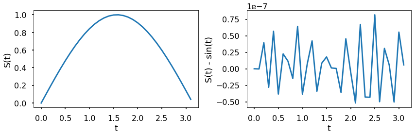
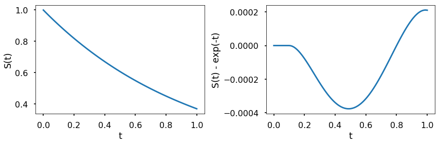
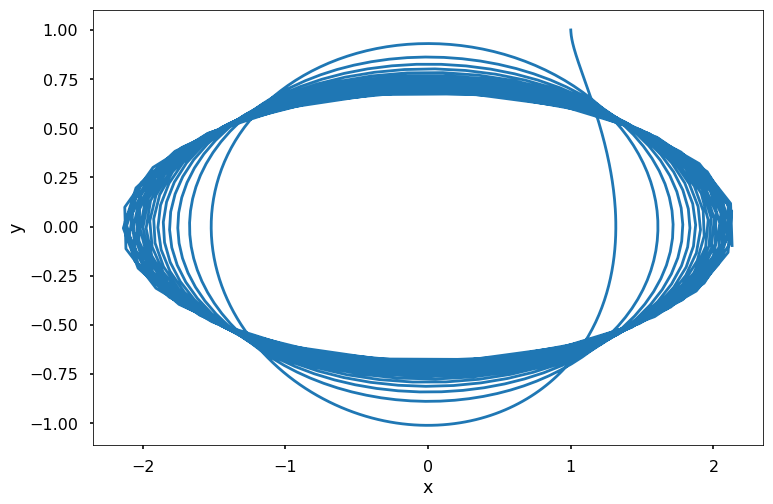

```html
<h1>Розв'язувачі ОДР в Python<a href="#python-ode-solvers" title="Постійне посилання на цей заголовок"></a></h1>
<p>У <em>scipy</em> є кілька вбудованих функцій для розв'язання задач з початковими умовами (задач Коші). Найчастіше використовується функція <em>scipy.integrate.solve_ivp</em>. Конструкція функції показана нижче:</p>
<p><strong>КОНСТРУКЦІЯ:</strong></p>
<p>Нехай <span>\(F\)</span> — це об'єкт-функція, що обчислює</p>

\[\frac{dS(t)}{dt} = F(t, S(t))\]

\[S(t0)=S0\]
<p><span>\(t\)</span> — це одновимірна незалежна змінна (час), <span>\(S(t)\)</span> — це n-вимірна вектор-функція (стан), а <span>\(F(t, S(t))\)</span> визначає диференціальні рівняння. <span>\(S0\)</span> — це початкове значення для <span>\(S\)</span>. Функція <span>\(F\)</span> <em>повинна</em> мати вигляд <span>\(dS = F(t, S)\)</span>, хоча її назва не обов'язково має бути <span>\(F\)</span>. Мета полягає в тому, щоб знайти <span>\(S(t)\)</span>, яке наближено задовольняє диференціальні рівняння, враховуючи початкову умову <span>\(S(t0)=S0\)</span>.</p>
<p>Спосіб використання розв'язувача для диференціального рівняння такий: <code><span>solve_ivp(fun,</span> <span>t_span,</span> <span>s0,</span> <span>method</span> <span>=</span> <span>'RK45',</span> <span>t_eval=None)</span></code></p>
<p>де <span>\(fun\)</span> приймає функцію, що знаходиться у правій частині системи. <span>\(t\_span\)</span> — це інтервал інтегрування <span>\((t0, tf)\)</span>, де <span>\(t0\)</span> — початок, а <span>\(tf\)</span> — кінець інтервалу. <span>\(s0\)</span> — це початковий стан. Існує кілька методів, які ми можемо обрати, за замовчуванням це 'RK45', що є явним методом Рунге-Кутти порядку 5(4). Ви також можете використовувати інші методи, дивіться кінець цього розділу для отримання додаткової інформації. <span>\(t\_eval\)</span> приймає моменти часу, в які потрібно зберегти обчислений розв'язок, і вони повинні бути відсортовані та знаходитись в межах <span>\(t\_span\)</span>.</p>
<p>Розглянемо один приклад нижче.</p>
<p><strong>ПРИКЛАД:</strong> Розглянемо ОДР</p>

\[
\frac{dS(t)}{dt}=\cos(t)
\]
<p>з початковою умовою <span>\(S_0 = 0\)</span>. Точний розв'язок цієї задачі — <span>\(S(t) = \sin(t)\)</span>. Використайте <em>solve_ivp</em> для наближеного розв'язання цієї задачі з початковими умовами на інтервалі <span>\([0, \pi]\)</span>. Побудуйте графік наближеного розв'язку порівняно з точним розв'язком та відносну похибку в часі.</p>


<pre><span></span><span>import</span> <span>matplotlib.pyplot</span> <span>as</span> <span>plt</span>
<span>import</span> <span>numpy</span> <span>as</span> <span>np</span>
<span>from</span> <span>scipy.integrate</span> <span>import</span> <span>solve_ivp</span>

<span>plt</span><span>.</span><span>style</span><span>.</span><span>use</span><span>(</span><span>'seaborn-poster'</span><span>)</span>

<span>%</span><span>matplotlib</span> inline

<span>F</span> <span>=</span> <span>lambda</span> <span>t</span><span>,</span> <span>s</span><span>:</span> <span>np</span><span>.</span><span>cos</span><span>(</span><span>t</span><span>)</span>

<span>t_eval</span> <span>=</span> <span>np</span><span>.</span><span>arange</span><span>(</span><span>0</span><span>,</span> <span>np</span><span>.</span><span>pi</span><span>,</span> <span>0.1</span><span>)</span>
<span>sol</span> <span>=</span> <span>solve_ivp</span><span>(</span><span>F</span><span>,</span> <span>[</span><span>0</span><span>,</span> <span>np</span><span>.</span><span>pi</span><span>],</span> <span>[</span><span>0</span><span>],</span> <span>t_eval</span><span>=</span><span>t_eval</span><span>)</span>

<span>plt</span><span>.</span><span>figure</span><span>(</span><span>figsize</span> <span>=</span> <span>(</span><span>12</span><span>,</span> <span>4</span><span>))</span>
<span>plt</span><span>.</span><span>subplot</span><span>(</span><span>121</span><span>)</span>
<span>plt</span><span>.</span><span>plot</span><span>(</span><span>sol</span><span>.</span><span>t</span><span>,</span> <span>sol</span><span>.</span><span>y</span><span>[</span><span>0</span><span>])</span>
<span>plt</span><span>.</span><span>xlabel</span><span>(</span><span>'t'</span><span>)</span>
<span>plt</span><span>.</span><span>ylabel</span><span>(</span><span>'S(t)'</span><span>)</span>
<span>plt</span><span>.</span><span>subplot</span><span>(</span><span>122</span><span>)</span>
<span>plt</span><span>.</span><span>plot</span><span>(</span><span>sol</span><span>.</span><span>t</span><span>,</span> <span>sol</span><span>.</span><span>y</span><span>[</span><span>0</span><span>]</span> <span>-</span> <span>np</span><span>.</span><span>sin</span><span>(</span><span>sol</span><span>.</span><span>t</span><span>))</span>
<span>plt</span><span>.</span><span>xlabel</span><span>(</span><span>'t'</span><span>)</span>
<span>plt</span><span>.</span><span>ylabel</span><span>(</span><span>'S(t) - sin(t)'</span><span>)</span>
<span>plt</span><span>.</span><span>tight_layout</span><span>()</span>
<span>plt</span><span>.</span><span>show</span><span>()</span>
</pre>


<p>На лівому графіку вище показано інтегрування <span>\(\frac{dS(t)}{dt}=\cos(t)\)</span> за допомогою <em>solve_ivp</em>. Правий графік обчислює різницю між розв'язком, отриманим за допомогою <em>solve_ivp</em>, та аналітичним розв'язком цього ОДР. Як видно з графіка, різниця між наближеним і точним розв'язком цього ОДР є малою. Також ми можемо контролювати відносну та абсолютну похибки за допомогою аргументів <em>rtol</em> та <em>atol</em>; розв'язувач утримує локальні оцінки похибки меншими за <span>\(atol + rtol*abs(S)\)</span>. Значення за замовчуванням становлять 1e-3 для rtol та 1e-6 для atol.</p>
<p><strong>СПРОБУЙТЕ!</strong> Використовуючи <em>rtol</em> та <em>atol</em>, зробіть так, щоб різниця між наближеним та точним розв'язком була меншою за 1e-7.</p>


<pre><span></span><span>sol</span> <span>=</span> <span>solve_ivp</span><span>(</span><span>F</span><span>,</span> <span>[</span><span>0</span><span>,</span> <span>np</span><span>.</span><span>pi</span><span>],</span> <span>[</span><span>0</span><span>],</span> <span>t_eval</span><span>=</span><span>t_eval</span><span>,</span> \
                <span>rtol</span> <span>=</span> <span>1e-8</span><span>,</span> <span>atol</span> <span>=</span> <span>1e-8</span><span>)</span>

<span>plt</span><span>.</span><span>figure</span><span>(</span><span>figsize</span> <span>=</span> <span>(</span><span>12</span><span>,</span> <span>4</span><span>))</span>
<span>plt</span><span>.</span><span>subplot</span><span>(</span><span>121</span><span>)</span>
<span>plt</span><span>.</span><span>plot</span><span>(</span><span>sol</span><span>.</span><span>t</span><span>,</span> <span>sol</span><span>.</span><span>y</span><span>[</span><span>0</span><span>])</span>
<span>plt</span><span>.</span><span>xlabel</span><span>(</span><span>'t'</span><span>)</span>
<span>plt</span><span>.</span><span>ylabel</span><span>(</span><span>'S(t)'</span><span>)</span>
<span>plt</span><span>.</span><span>subplot</span><span>(</span><span>122</span><span>)</span>
<span>plt</span><span>.</span><span>plot</span><span>(</span><span>sol</span><span>.</span><span>t</span><span>,</span> <span>sol</span><span>.</span><span>y</span><span>[</span><span>0</span><span>]</span> <span>-</span> <span>np</span><span>.</span><span>sin</span><span>(</span><span>sol</span><span>.</span><span>t</span><span>))</span>
<span>plt</span><span>.</span><span>xlabel</span><span>(</span><span>'t'</span><span>)</span>
<span>plt</span><span>.</span><span>ylabel</span><span>(</span><span>'S(t) - sin(t)'</span><span>)</span>
<span>plt</span><span>.</span><span>tight_layout</span><span>()</span>
<span>plt</span><span>.</span><span>show</span><span>()</span>
</pre>





<p><strong>ПРИКЛАД:</strong> Розглянемо ОДР</p>

\[
\frac{dS(t)}{dt} = -S(t),
\]
<p>з початковою умовою <span>\(S_0 = 1\)</span>. Точний розв'язок цієї задачі — <span>\(S(t) = e^{-t}\)</span>. Використайте <em>solve_ivp</em> для наближеного розв'язання цієї задачі з початковими умовами на інтервалі <span>\([0, 1]\)</span>. Побудуйте графік наближеного розв'язку порівняно з точним розв'язком та відносну похибку в часі.</p>


<pre><span></span><span>F</span> <span>=</span> <span>lambda</span> <span>t</span><span>,</span> <span>s</span><span>:</span> <span>-</span><span>s</span>

<span>t_eval</span> <span>=</span> <span>np</span><span>.</span><span>arange</span><span>(</span><span>0</span><span>,</span> <span>1.01</span><span>,</span> <span>0.01</span><span>)</span>
<span>sol</span> <span>=</span> <span>solve_ivp</span><span>(</span><span>F</span><span>,</span> <span>[</span><span>0</span><span>,</span> <span>1</span><span>],</span> <span>[</span><span>1</span><span>],</span> <span>t_eval</span><span>=</span><span>t_eval</span><span>)</span>

<span>plt</span><span>.</span><span>figure</span><span>(</span><span>figsize</span> <span>=</span> <span>(</span><span>12</span><span>,</span> <span>4</span><span>))</span>
<span>plt</span><span>.</span><span>subplot</span><span>(</span><span>121</span><span>)</span>
<span>plt</span><span>.</span><span>plot</span><span>(</span><span>sol</span><span>.</span><span>t</span><span>,</span> <span>sol</span><span>.</span><span>y</span><span>[</span><span>0</span><span>])</span>
<span>plt</span><span>.</span><span>xlabel</span><span>(</span><span>'t'</span><span>)</span>
<span>plt</span><span>.</span><span>ylabel</span><span>(</span><span>'S(t)'</span><span>)</span>
<span>plt</span><span>.</span><span>subplot</span><span>(</span><span>122</span><span>)</span>
<span>plt</span><span>.</span><span>plot</span><span>(</span><span>sol</span><span>.</span><span>t</span><span>,</span> <span>sol</span><span>.</span><span>y</span><span>[</span><span>0</span><span>]</span> <span>-</span> <span>np</span><span>.</span><span>exp</span><span>(</span><span>-</span><span>sol</span><span>.</span><span>t</span><span>))</span>
<span>plt</span><span>.</span><span>xlabel</span><span>(</span><span>'t'</span><span>)</span>
<span>plt</span><span>.</span><span>ylabel</span><span>(</span><span>'S(t) - exp(-t)'</span><span>)</span>
<span>plt</span><span>.</span><span>tight_layout</span><span>()</span>
<span>plt</span><span>.</span><span>show</span><span>()</span>
</pre>





<p>Наведений вище графік показує відповідні числові результати. Як і в попередньому прикладі, різниця між результатом <em>solve_ivp</em> та обчисленням аналітичного розв'язку в Python є дуже малою порівняно зі значенням функції.</p>
<p><strong>ПРИКЛАД:</strong></p>
<p>Нехай стан системи визначається як <span>\(S(t) = \left[\begin{array}{c} x(t) \\y(t) \end{array}\right]\)</span>, а еволюція системи визначається ОДР</p>

\[\begin{split}
\frac{dS(t)}{dt} = \left[\begin{array}{cc}
0 &amp; t^2 \\
-t &amp; 0
\end{array}\right]S(t).
\end{split}\]
<p>Використайте <em>solve_ivp</em> для розв'язання цього ОДР на часовому інтервалі <span>\([0, 10]\)</span> з початковою умовою <span>\(S_0 = \left[\begin{array}{c} 1 \\1 \end{array}\right]\)</span>. Побудуйте графік розв'язку в координатах (<span>\(x(t), y(t)\)</span>).</p>


<pre><span></span><span>F</span> <span>=</span> <span>lambda</span> <span>t</span><span>,</span> <span>s</span><span>:</span> <span>np</span><span>.</span><span>dot</span><span>(</span><span>np</span><span>.</span><span>array</span><span>([[</span><span>0</span><span>,</span> <span>t</span><span>**</span><span>2</span><span>],</span> <span>[</span><span>-</span><span>t</span><span>,</span> <span>0</span><span>]]),</span> <span>s</span><span>)</span>

<span>t_eval</span> <span>=</span> <span>np</span><span>.</span><span>arange</span><span>(</span><span>0</span><span>,</span> <span>10.01</span><span>,</span> <span>0.01</span><span>)</span>
<span>sol</span> <span>=</span> <span>solve_ivp</span><span>(</span><span>F</span><span>,</span> <span>[</span><span>0</span><span>,</span> <span>10</span><span>],</span> <span>[</span><span>1</span><span>,</span> <span>1</span><span>],</span> <span>t_eval</span><span>=</span><span>t_eval</span><span>)</span>

<span>plt</span><span>.</span><span>figure</span><span>(</span><span>figsize</span> <span>=</span> <span>(</span><span>12</span><span>,</span> <span>8</span><span>))</span>
<span>plt</span><span>.</span><span>plot</span><span>(</span><span>sol</span><span>.</span><span>y</span><span>.</span><span>T</span><span>[:,</span> <span>0</span><span>],</span> <span>sol</span><span>.</span><span>y</span><span>.</span><span>T</span><span>[:,</span> <span>1</span><span>])</span>
<span>plt</span><span>.</span><span>xlabel</span><span>(</span><span>'x'</span><span>)</span>
<span>plt</span><span>.</span><span>ylabel</span><span>(</span><span>'y'</span><span>)</span>
<span>plt</span><span>.</span><span>show</span><span>()</span>
</pre>



```
