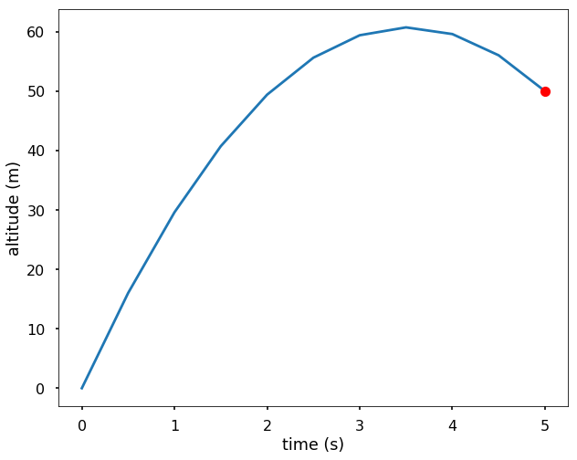
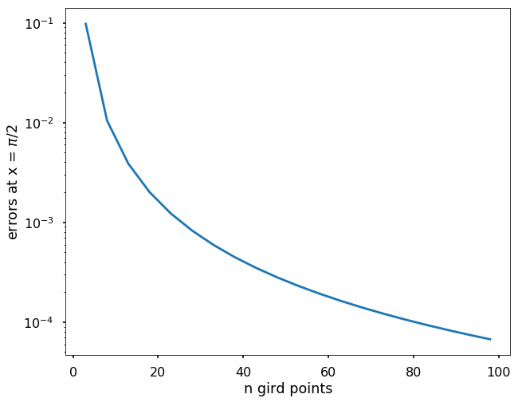

```html
<h1>Метод скінченних різниць<a href="#finite-difference-method" title="Постійне посилання на цей заголовок"></a></h1>
<p>Іншим способом розв'язання крайових задач для ЗДР є <strong>метод скінченних різниць</strong>, де ми можемо використовувати скінченно-різницеві формули в рівновіддалених вузлах сітки для апроксимації диференціальних рівнянь. Таким чином, ми можемо перетворити диференціальне рівняння на систему алгебраїчних рівнянь для розв'язання.</p>
<p>У методі скінченних різниць похідні в диференціальному рівнянні апроксимуються за допомогою скінченно-різницевих формул. Ми можемо розділити інтервал <span>\([a, b]\)</span> на <span>\(n\)</span> рівних підінтервалів довжиною <span>\(h\)</span>, як показано на наступному малюнку.</p>

<p>Зазвичай, у методах скінченних різниць ми використовуємо формули центральних різниць, оскільки вони дають кращу точність. Диференціальне рівняння застосовується лише у вузлах сітки, а перша та друга похідні мають вигляд:</p>

\[\frac{dy}{dx} = \frac{y_{i+1}-y_{i-1}}{2h}\]

\[\frac{d^2y}{dx^2} = \frac{y_{i-1}-2y_i+y_{i+1}}{h^2}\]
<p>Ці скінченно-різницеві вирази використовуються для заміни похідних <span>\(y\)</span> у диференціальному рівнянні, що призводить до системи з <span>\(n+1\)</span> лінійних алгебраїчних рівнянь, якщо диференціальне рівняння є лінійним. Якщо диференціальне рівняння нелінійне, алгебраїчні рівняння також будуть нелінійними.</p>
<p><strong>ПРИКЛАД:</strong> Розв'яжіть задачу про ракету з попереднього розділу, використовуючи метод скінченних різниць, та побудуйте графік висоти ракети після запуску. ЗДР має вигляд</p>

\[ \frac{d^2y}{dt^2} = -g\]
<p>з граничними умовами <span>\(y(0) = 0\)</span> та <span>\(y(5) = 50\)</span>. Візьмемо <span>\(n=10\)</span>.</p>
<p>Оскільки часовий інтервал становить <span>\([0, 5]\)</span> і ми маємо <span>\(n=10\)</span>, то <span>\(h=0.5\)</span>. Використовуючи скінченно-різницеву апроксимацію похідних, отримуємо</p>

\[ y_0 = 0\]

\[ y_{i-1} - 2y_i + y_{i+1} = -gh^2, \;i = 1, 2, ..., n-1\]

\[ y_{10} = 50\]
<p>якщо ми використаємо матричний запис, то матимемо:</p>

\[\begin{split}\begin{bmatrix}
1 &amp; 0 &amp; &amp; &amp; \\
1 &amp; -2 &amp; 1 &amp; &amp;  \\
 &amp; \ddots &amp; \ddots &amp; \ddots &amp; \\
 &amp; &amp; 1&amp; -2&amp; 1 \\
 &amp; &amp; &amp; &amp;1
\end{bmatrix}\left[\begin{array}{c} y_0 \\y_1 \\ ... \\ y_{n-1}\\y_n \end{array}\right] =
\left[\begin{array}{c} 0 \\-gh^2 \\ ... \\ -gh^2 \\50\end{array}\right]\end{split}\]
<p>Отже, ми маємо 11 рівнянь у системі, яку можемо розв'язати методом, вивченим у розділі 14.</p>


<pre><span></span><span>import</span> <span>numpy</span> <span>as</span> <span>np</span>
<span>import</span> <span>matplotlib.pyplot</span> <span>as</span> <span>plt</span>
<span>plt</span><span>.</span><span>style</span><span>.</span><span>use</span><span>(</span><span>'seaborn-poster'</span><span>)</span>
<span>%</span><span>matplotlib</span> inline

<span>n</span> <span>=</span> <span>10</span>
<span>h</span> <span>=</span> <span>(</span><span>5</span><span>-</span><span>0</span><span>)</span> <span>/</span> <span>n</span>

<span># Отримуємо A</span>
<span>A</span> <span>=</span> <span>np</span><span>.</span><span>zeros</span><span>((</span><span>n</span><span>+</span><span>1</span><span>,</span> <span>n</span><span>+</span><span>1</span><span>))</span>
<span>A</span><span>[</span><span>0</span><span>,</span> <span>0</span><span>]</span> <span>=</span> <span>1</span>
<span>A</span><span>[</span><span>n</span><span>,</span> <span>n</span><span>]</span> <span>=</span> <span>1</span>
<span>for</span> <span>i</span> <span>in</span> <span>range</span><span>(</span><span>1</span><span>,</span> <span>n</span><span>):</span>
    <span>A</span><span>[</span><span>i</span><span>,</span> <span>i</span><span>-</span><span>1</span><span>]</span> <span>=</span> <span>1</span>
    <span>A</span><span>[</span><span>i</span><span>,</span> <span>i</span><span>]</span> <span>=</span> <span>-</span><span>2</span>
    <span>A</span><span>[</span><span>i</span><span>,</span> <span>i</span><span>+</span><span>1</span><span>]</span> <span>=</span> <span>1</span>

<span>print</span><span>(</span><span>A</span><span>)</span>

<span># Отримуємо b</span>
<span>b</span> <span>=</span> <span>np</span><span>.</span><span>zeros</span><span>(</span><span>n</span><span>+</span><span>1</span><span>)</span>
<span>b</span><span>[</span><span>1</span><span>:</span><span>-</span><span>1</span><span>]</span> <span>=</span> <span>-</span><span>9.8</span><span>*</span><span>h</span><span>**</span><span>2</span>
<span>b</span><span>[</span><span>-</span><span>1</span><span>]</span> <span>=</span> <span>50</span>
<span>print</span><span>(</span><span>b</span><span>)</span>

<span># розв'язуємо систему лінійних рівнянь</span>
<span>y</span> <span>=</span> <span>np</span><span>.</span><span>linalg</span><span>.</span><span>solve</span><span>(</span><span>A</span><span>,</span> <span>b</span><span>)</span>

<span>t</span> <span>=</span> <span>np</span><span>.</span><span>linspace</span><span>(</span><span>0</span><span>,</span> <span>5</span><span>,</span> <span>11</span><span>)</span>

<span>plt</span><span>.</span><span>figure</span><span>(</span><span>figsize</span><span>=</span><span>(</span><span>10</span><span>,</span><span>8</span><span>))</span>
<span>plt</span><span>.</span><span>plot</span><span>(</span><span>t</span><span>,</span> <span>y</span><span>)</span>
<span>plt</span><span>.</span><span>plot</span><span>(</span><span>5</span><span>,</span> <span>50</span><span>,</span> <span>'ro'</span><span>)</span>
<span>plt</span><span>.</span><span>xlabel</span><span>(</span><span>'час (с)'</span><span>)</span>
<span>plt</span><span>.</span><span>ylabel</span><span>(</span><span>'висота (м)'</span><span>)</span>
<span>plt</span><span>.</span><span>show</span><span>()</span>
</pre>


<pre><span></span>[[ 1.  0.  0.  0.  0.  0.  0.  0.  0.  0.  0.]
 [ 1. -2.  1.  0.  0.  0.  0.  0.  0.  0.  0.]
 [ 0.  1. -2.  1.  0.  0.  0.  0.  0.  0.  0.]
 [ 0.  0.  1. -2.  1.  0.  0.  0.  0.  0.  0.]
 [ 0.  0.  0.  1. -2.  1.  0.  0.  0.  0.  0.]
 [ 0.  0.  0.  0.  1. -2.  1.  0.  0.  0.  0.]
 [ 0.  0.  0.  0.  0.  1. -2.  1.  0.  0.  0.]
 [ 0.  0.  0.  0.  0.  0.  1. -2.  1.  0.  0.]
 [ 0.  0.  0.  0.  0.  0.  0.  1. -2.  1.  0.]
 [ 0.  0.  0.  0.  0.  0.  0.  0.  1. -2.  1.]
 [ 0.  0.  0.  0.  0.  0.  0.  0.  0.  0.  1.]]
[ 0.   -2.45 -2.45 -2.45 -2.45 -2.45 -2.45 -2.45 -2.45 -2.45 50.  ]
</pre>




<p>Тепер розв'яжемо для <span>\(y'(0)\)</span>. Зі скінченно-різницевої формули ми знаємо, що <span>\(\frac{dy}{dx} = \frac{y_{i+1}-y_{i-1}}{2h}\)</span>, що означає <span>\(y'(0) = \frac{y_{1} - y_{-1}}{2h}\)</span>, але ми не знаємо, чому дорівнює <span>\(y_{-1}\)</span>. Насправді, ми можемо обчислити <span>\(y_{-1}\)</span>, оскільки ми знаємо значення <span>\(y\)</span> в кожному вузлі сітки. Зі скінченно-різницевої формули для другої похідної ми знаємо, що <span>\(\frac{y_{-1}-2y_0+y_{1}}{h^2} = -g\)</span>. Отже, ми можемо знайти <span>\(y_{-1}\)</span>, а потім отримати швидкість запуску. Дивіться обчислення нижче.</p>


<pre><span></span><span>y_n1</span> <span>=</span> <span>-</span><span>9.8</span><span>*</span><span>h</span><span>**</span><span>2</span> <span>+</span> <span>2</span><span>*</span><span>y</span><span>[</span><span>0</span><span>]</span> <span>-</span> <span>y</span><span>[</span><span>1</span><span>]</span>
<span>(</span><span>y</span><span>[</span><span>1</span><span>]</span> <span>-</span> <span>y_n1</span><span>)</span> <span>/</span> <span>(</span><span>2</span><span>*</span><span>h</span><span>)</span>
</pre>


<pre><span></span>34.5
</pre>


<p>Ми бачимо, що за допомогою методу скінченних різниць ми отримали правильну швидкість запуску. Щоб ви краще ознайомилися з методом, розглянемо ще один приклад.</p>
<p><strong>СПРОБУЙТЕ!</strong> Використовуючи метод скінченних різниць, розв'яжіть наступну лінійну крайову задачу</p>

\[ y'' = -4y +4x \]
<p>з граничними умовами <span>\(y(0) = 0\)</span> та <span>\(y'(\pi/2)=0\)</span>. Точний розв'язок задачі: <span>\(y=x-sin2x\)</span>. Побудуйте графік залежності похибок від кількості вузлів сітки n (n від 3 до 100) для граничної точки <span>\(y(\pi/2)\)</span>.</p>
<p>Використовуючи скінченно-різницеву апроксимацію похідних, отримуємо</p>

\[ y_0 = 0\]

\[ y_{i-1} - 2y_i + y_{i+1} -h^2(-4y_i+4x_i)=0 , \;i = 1, 2, ..., n-1\]

\[ 2y_{n-1}-2y_n -h^2(-4y_n+4x_n)=0\]
<p>Останнє рівняння випливає з того, що <span>\(\frac{y_{n+1}-y_{n-1}}{2h} = 0\)</span> (гранична умова <span>\(y'(\pi/2)=0\)</span>). Отже, <span>\(y_{n+1}=y_{n-1}\)</span>.</p>
<p>якщо ми використаємо матричний запис, то матимемо:</p>

\[\begin{split}\begin{bmatrix}
1 &amp; 0 &amp; &amp; &amp; \\
1 &amp; -2+4h^2 &amp; 1 &amp; &amp;  \\
 &amp; \ddots &amp; \ddots &amp; \ddots &amp; \\
 &amp; &amp; 1&amp; -2+4h^2 &amp; 1 \\
 &amp; &amp; &amp; 2 &amp;-2+4h^2
\end{bmatrix}\left[\begin{array}{c} y_0 \\y_1 \\ ... \\ y_{n-1}\\y_n \end{array}\right] =
\left[\begin{array}{c} 0 \\4h^2x_1 \\ ... \\ 4h^2x_{n-1} \\4h^2x_{n}\end{array}\right]\end{split}\]


<pre><span></span><span>def</span> <span>get_a_b</span><span>(</span><span>n</span><span>):</span>
    <span>h</span> <span>=</span> <span>(</span><span>np</span><span>.</span><span>pi</span><span>/</span><span>2</span><span>-</span><span>0</span><span>)</span> <span>/</span> <span>n</span>
    <span>x</span> <span>=</span> <span>np</span><span>.</span><span>linspace</span><span>(</span><span>0</span><span>,</span> <span>np</span><span>.</span><span>pi</span><span>/</span><span>2</span><span>,</span> <span>n</span><span>+</span><span>1</span><span>)</span>
    <span># Отримуємо A</span>
    <span>A</span> <span>=</span> <span>np</span><span>.</span><span>zeros</span><span>((</span><span>n</span><span>+</span><span>1</span><span>,</span> <span>n</span><span>+</span><span>1</span><span>))</span>
    <span>A</span><span>[</span><span>0</span><span>,</span> <span>0</span><span>]</span> <span>=</span> <span>1</span>
    <span>A</span><span>[</span><span>n</span><span>,</span> <span>n</span><span>]</span> <span>=</span> <span>-</span><span>2</span><span>+</span><span>4</span><span>*</span><span>h</span><span>**</span><span>2</span>
    <span>A</span><span>[</span><span>n</span><span>,</span> <span>n</span><span>-</span><span>1</span><span>]</span> <span>=</span> <span>2</span>
    <span>for</span> <span>i</span> <span>in</span> <span>range</span><span>(</span><span>1</span><span>,</span> <span>n</span><span>):</span>
        <span>A</span><span>[</span><span>i</span><span>,</span> <span>i</span><span>-</span><span>1</span><span>]</span> <span>=</span> <span>1</span>
        <span>A</span><span>[</span><span>i</span><span>,</span> <span>i</span><span>]</span> <span>=</span> <span>-</span><span>2</span><span>+</span><span>4</span><span>*</span><span>h</span><span>**</span><span>2</span>
        <span>A</span><span>[</span><span>i</span><span>,</span> <span>i</span><span>+</span><span>1</span><span>]</span> <span>=</span> <span>1</span>

    <span># Отримуємо b</span>
    <span>b</span> <span>=</span> <span>np</span><span>.</span><span>zeros</span><span>(</span><span>n</span><span>+</span><span>1</span><span>)</span>
    <span>for</span> <span>i</span> <span>in</span> <span>range</span><span>(</span><span>1</span><span>,</span> <span>n</span><span>+</span><span>1</span><span>):</span>
        <span>b</span><span>[</span><span>i</span><span>]</span> <span>=</span> <span>4</span><span>*</span><span>h</span><span>**</span><span>2</span><span>*</span><span>x</span><span>[</span><span>i</span><span>]</span>
    
    <span>return</span> <span>x</span><span>,</span> <span>A</span><span>,</span> <span>b</span>

<span>x</span> <span>=</span> <span>np</span><span>.</span><span>pi</span><span>/</span><span>2</span>
<span>v</span> <span>=</span> <span>x</span> <span>-</span> <span>np</span><span>.</span><span>sin</span><span>(</span><span>2</span><span>*</span><span>x</span><span>)</span>

<span>n_s</span> <span>=</span> <span>[]</span>
<span>errors</span> <span>=</span> <span>[]</span>

<span>for</span> <span>n</span> <span>in</span> <span>range</span><span>(</span><span>3</span><span>,</span> <span>100</span><span>,</span> <span>5</span><span>):</span>
    <span>x</span><span>,</span> <span>A</span><span>,</span> <span>b</span> <span>=</span> <span>get_a_b</span><span>(</span><span>n</span><span>)</span>
    <span>y</span> <span>=</span> <span>np</span><span>.</span><span>linalg</span><span>.</span><span>solve</span><span>(</span><span>A</span><span>,</span> <span>b</span><span>)</span>
    <span>n_s</span><span>.</span><span>append</span><span>(</span><span>n</span><span>)</span>
    <span>e</span> <span>=</span> <span>v</span> <span>-</span> <span>y</span><span>[</span><span>-</span><span>1</span><span>]</span>
    <span>errors</span><span>.</span><span>append</span><span>(</span><span>e</span><span>)</span>
    
<span>plt</span><span>.</span><span>figure</span><span>(</span><span>figsize</span> <span>=</span> <span>(</span><span>10</span><span>,</span><span>8</span><span>))</span>
<span>plt</span><span>.</span><span>plot</span><span>(</span><span>n_s</span><span>,</span> <span>errors</span><span>)</span>
<span>plt</span><span>.</span><span>yscale</span><span>(</span><span>'log'</span><span>)</span>
<span>plt</span><span>.</span><span>xlabel</span><span>(</span><span>'кількість вузлів сітки n'</span><span>)</span>
<span>plt</span><span>.</span><span>ylabel</span><span>(</span><span>'похибки в точці x = $\pi/2$'</span><span>)</span>
<span>plt</span><span>.</span><span>show</span><span>()</span>
</pre>





<p>Ми бачимо, що зі збільшенням щільності сітки ми наближаємося до точного розв'язку в граничній точці.</p>
<p>Метод скінченних різниць також можна застосовувати до ЗДР вищих порядків, але для цього потрібна апроксимація похідних вищих порядків за допомогою скінченно-різницевих формул. Наприклад, якщо ми розв'язуємо ЗДР четвертого порядку, нам потрібно буде використати наступне:</p>

\[\frac{d^4y}{dx^4} = \frac{y_{i-2}-4y_{i-1}+6y_i-4y_{i+1}+y_{i+2}}{h^4}\]
<p>Ми не будемо детальніше зупинятися на ЗДР вищих порядків, оскільки ідея їх розв'язання схожа на ту, що ми обговорювали вище для ЗДР другого порядку.</p>
```
