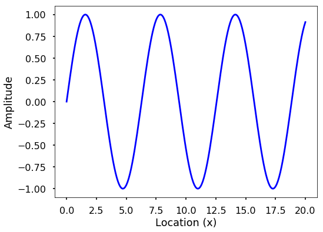
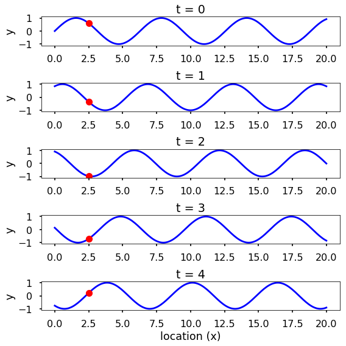
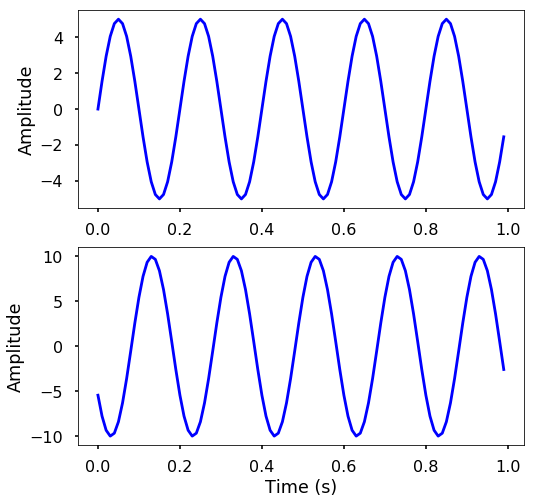

<h1>Основи хвиль</h1>

У нашому житті існує багато типів хвиль, наприклад, якщо кинути камінь у ставок, можна побачити, як хвилі утворюються та поширюються у воді. Звісно, є багато інших прикладів хвиль, деякі з них навіть важко побачити, такі як звукові хвилі, хвилі землетрусів, мікрохвилі (які ми використовуємо для приготування їжі на кухні). Але у фізиці хвиля — це збурення, що поширюється у просторі та матерії, передаючи енергію з одного місця в інше. Важливо вивчати хвилі в нашому житті, щоб зрозуміти, як вони утворюються, поширюються тощо. У цьому розділі ми розглянемо основний інструмент, який допомагає нам розуміти та вивчати хвилі — **перетворення Фур'є**. Але перш ніж продовжити, давайте спочатку ознайомимося з тим, як ми насправді моделюємо та вивчаємо хвилі.

<h2>Моделювання хвилі за допомогою математичних інструментів</h2>

Ми можемо змоделювати одну хвилю як поле за допомогою функції \(F(x, t)\), де \(x\) — це розташування точки в просторі, а \(t\) — час. Найпростіший випадок — це зміна форми синусоїдальної хвилі за \(x\).

<pre>import matplotlib.pyplot as plt
import numpy as np

plt.style.use('seaborn-poster')
%matplotlib inline
</pre>

<pre>x = np.linspace(0, 20, 201)
y = np.sin(x)

plt.figure(figsize = (8, 6))
plt.plot(x, y, 'b')
plt.ylabel('Amplitude')
plt.xlabel('Location (x)')
plt.show()
</pre>

Ми можемо уявити, що синусоїдальна хвиля може змінюватися як у часі, так і в просторі. Якщо ми побудуємо графік змін у різних місцях, кожен часовий знімок буде синусоїдальною хвилею, що змінюється залежно від розташування. Дивіться наступний малюнок із фіксованою точкою в \(x=2.5\), показаною червоною крапкою. Звісно, ви також можете побачити зміни в часі в певному місці, ви можете побудувати цей графік самостійно.

<pre>fig = plt.figure(figsize = (8,8))

times = np.arange(5)

n = len(times)

for t in times:
    plt.subplot(n, 1, t+1)
    y = np.sin(x + t)
    plt.plot(x, y , 'b')
    plt.plot(x[25], y [25], 'ro')
    plt.ylim(-1.1, 1.1)
    plt.ylabel('y')
    plt.title(f't = {t}')

plt.xlabel('location (x)')
plt.tight_layout()
plt.show()
</pre>

<h2>Характеристики хвилі</h2>

Ми бачимо, що хвилі можуть бути безперервною сутністю як у часі, так і в просторі. Але в реальності ми часто дискретизуємо час і простір у різних точках. Наприклад, ми можемо використовувати датчики, такі як акселерометри (які можуть вимірювати прискорення руху), у різних місцях на Землі для моніторингу землетрусів, що є просторовою дискретизацією. Аналогічно, ці датчики зазвичай записують дані в певний час, що є часовою дискретизацією. Для однієї хвилі існують різні характеристики. Дивіться наступні два малюнки.

**Амплітуда** використовується для опису різниці між максимальними значеннями та базовим значенням (див. вищезазначені малюнки). Синусоїдальна хвиля є періодичним сигналом, що означає, що вона повторюється через певний час, який можна виміряти за допомогою **періоду**. Період хвилі — це час, необхідний для завершення повного циклу; на малюнку ми бачимо, що період можна виміряти за двома сусідніми піками. **Довжина хвилі** вимірює відстань між двома послідовними гребенями або западинами хвилі. **Частота** описує кількість хвиль, що проходять через фіксоване місце за певний проміжок часу. Частоту можна виміряти за кількістю циклів, що проходять за 1 секунду. Отже, одиницею частоти є цикли/секунду, або частіше використовується **Герц** (скорочено **Гц**). Частота відрізняється від періоду, але вони пов'язані між собою. Частота вказує, як часто щось відбувається, тоді як період вказує на час, необхідний для завершення чогось, математично,

\[period = \frac{1}{frequency}\]

З двох малюнків ми також бачимо сині крапки на синусоїдальних хвилях — це точки дискретизації, які ми зробили як у часі, так і в просторі. Отже, лише в цих точках ми взяли значення хвилі. Зазвичай, коли ми записуємо хвилю, нам потрібно вказати, як часто ми беремо зразки хвилі в часі, це називається **дискретизацією** (або **вибіркою**). І ця швидкість називається **частотою дискретизації** (або **частотою вибірки**), з одиницею Гц. Наприклад, якщо ми дискретизуємо хвилю з частотою 2 Гц, це означає, що кожну секунду ми беремо дві точки даних. Оскільки ми краще розуміємо основи хвилі, тепер давайте розглянемо синусоїдальну хвилю уважніше. Синусоїдальна хвиля може бути представлена наступним рівнянням:

\[ y(t) = Asin(\omega{t}+\phi)\]

де \(A\) — амплітуда хвилі, \(\omega\) — **кутова частота**, яка визначає, скільки циклів відбувається за секунду, у радіанах за секунду. \(\phi\) — **фаза** сигналу. Якщо \(T\) — період хвилі, а \(f\) — частота хвилі, то \(\omega\) має наступний зв'язок з ними:

\[\omega = \frac{2\pi}{T} = 2\pi{f}\]

**СПРОБУЙТЕ!** Згенеруйте дві синусоїдальні хвилі з часом від 0 до 1 секунди та частотою 5 Гц і 10 Гц, усі дискретизовані з частотою 100 Гц. Побудуйте графіки двох хвиль і подивіться різницю. Підрахуйте, скільки циклів відбувається за 1 секунду.

<pre># sampling rate
sr = 100.0
# sampling interval
ts = 1.0/sr
t = np.arange(0,1,ts)

# frequency of the signal
freq = 5   
y = np.sin(2*np.pi*freq*t)

plt.figure(figsize = (8, 8))
plt.subplot(211)
plt.plot(t, y, 'b')
plt.ylabel('Amplitude')

freq = 10   
y = np.sin(2*np.pi*freq*t)

plt.subplot(212)
plt.plot(t, y, 'b')
plt.ylabel('Amplitude')

plt.xlabel('Time (s)')
plt.show()
</pre>

**СПРОБУЙТЕ!** Згенеруйте дві синусоїдальні хвилі з часом від 0 до 1 секунди. Обидві хвилі мають частоту 5 Гц і дискретизовані з частотою 100 Гц, але фаза становить 0 і 10 відповідно. Також амплітуда двох хвиль становить 5 і 10. Побудуйте графіки двох хвиль і подивіться різницю.

<pre># frequency of the signal
freq = 5   
y = 5*np.sin(2*np.pi*freq*t)

plt.figure(figsize = (8, 8))
plt.subplot(211)
plt.plot(t, y, 'b')
plt.ylabel('Amplitude')

y = 10*np.sin(2*np.pi*freq*t + 10)

plt.subplot(212)
plt.plot(t, y, 'b')
plt.ylabel('Amplitude')

plt.xlabel('Time (s)')
plt.show()
</pre>

