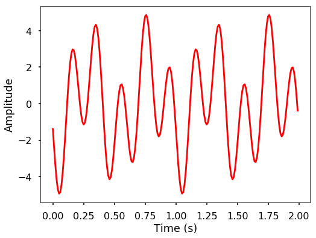
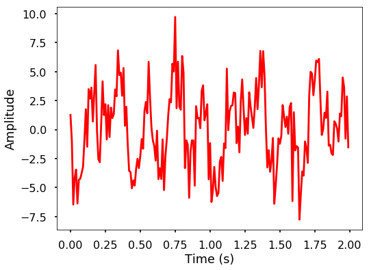

<h1>Підсумок</h1>
<ol>
<li>
Ми вивчили основи хвиль: частота, період, амплітуда та довжина хвилі є характеристиками хвиль.
</li>
<li>
Дискретне перетворення Фур'є (ДПФ) — це спосіб перетворення сигналу з часової області в частотну область за допомогою суми послідовності синусоїдальних хвиль.
</li>
<li>
Швидке перетворення Фур'є (ШПФ) — це алгоритм для ефективного обчислення ДПФ, використовуючи властивості симетрії в ДПФ.
</li>
</ol>

<h1>Задачі</h1>
<ol>
<li>
Вам доручено виміряти температуру в кімнаті. Щодня опівдні ви вимірюєте температуру та записуєте значення. Ви проводили вимірювання протягом 30 днів. Яка частота температурного сигналу, який ви отримали?
</li>
<li>
Який зв'язок між частотою та періодом хвилі?
</li>
<li>
Яка різниця між періодом та довжиною хвилі? Які між ними подібності?
</li>
<li>
Що таке представлення сигналу в часовій та частотній областях?
</li>
<li>
Згенеруйте два сигнали: сигнал 1 — синусоїдальна хвиля з частотою 5 Гц, амплітудою 3 та фазовим зсувом 3; сигнал 2 — синусоїдальна хвиля з частотою 2 Гц, амплітудою 2 та фазовим зсувом -2. Побудуйте графік сигналу за 2 секунди. Приклади:
</li>
</ol>

<pre># sampling rate
sr = 100
# sampling interval
ts = 1.0/sr
t = np.arange(0,2,ts)

freq = 5.
x = 3*np.sin(2*np.pi*freq*t + 3)

freq = 2
x += 2*np.sin(2*np.pi*freq*t - 2)

plt.figure(figsize = (8, 6))
plt.plot(t, x, 'r')
plt.ylabel('Amplitude')
plt.xlabel('Time (s)')
plt.show()
</pre>

<ol>
<li>
Оцифруйте сигнал, який ви згенерували в задачі 5, використовуючи частоту дискретизації 5, 10, 20, 50 та 100 Гц, і подивіться на відмінності між різними частотами дискретизації.
</li>
<li>
Дано сигнал t = [0, 1, 2, 3] та y = [0, 3, 2, 0], знайдіть дійсне ДПФ для X. Запишіть вираз для оберненого ДПФ. Зауважте, не використовуйте Python для пошуку результатів, замість цього запишіть рівняння та обчисліть значення.
</li>
<li>
Які амплітуда та фаза значень ДПФ для сигналу?
</li>
<li>
Ми реалізували ДПФ раніше, чи можете ви аналогічно реалізувати обернене дискретне перетворення Фур'є в Python?
</li>
<li>
Використайте функцію ДПФ та оберненого ДПФ, які ми реалізували, та згенеруйте амплітудний спектр для сигналу, який ви згенерували в задачі 5. Нормалізуйте амплітуду ДПФ, щоб отримати правильну відповідну амплітуду в часовій області.
</li>
<li>
Чи можете ви описати прийоми, що використовуються в ШПФ для прискорення обчислень?
</li>
<li>
Використайте функції fft та ifft з scipy, щоб повторити задачу 10.
</li>
<li>
Додайте випадковий шум з нормальним розподілом до сигналу в задачі 5 за допомогою numpy та побудуйте графік амплітудного спектра ШПФ, що ви бачите? Сигнал із шумом буде показано як наступний приклад.
</li>
</ol>

Приклад:

<pre>np.random.seed(10)
x_noise = x + \
  np.random.normal(0, 2, size = len(x))

plt.figure(figsize = (8, 6))
plt.plot(t, x_noise, 'r')
plt.ylabel('Amplitude')
plt.xlabel('Time (s)')
plt.show()
</pre>

