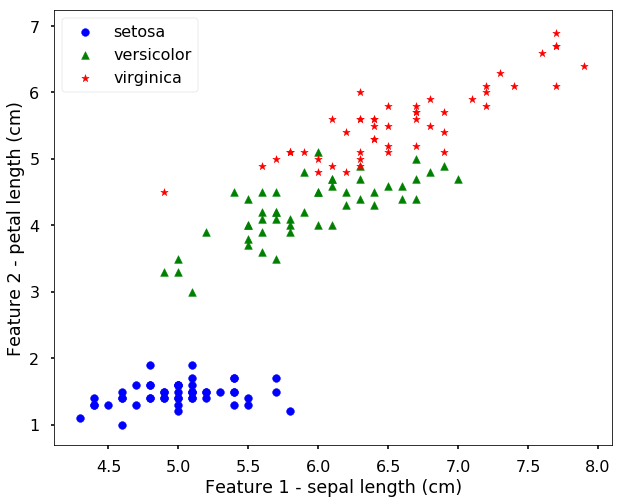
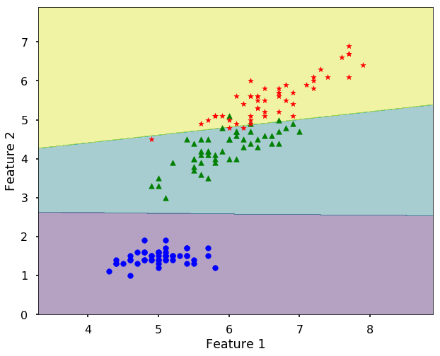

```html
<h1>Класифікація<a href="#classification" title="Permalink to this headline"></a></h1>
<p>Класифікація — це дуже поширена проблема в реальному світі. Наприклад, ми хочемо класифікувати деякі продукти на якісні та неякісні, електронні листи на звичайні та спам, книги на цікаві та нудні тощо. Як обговорювалося раніше, два ключові фактори перетворюють проблему на проблему класифікації: (1) проблема має правильну відповідь (мітки), і (2) результат, який ми хочемо отримати, є категоріальними даними, такими як "Так" або "Ні", або різні категорії.</p>
<p>Давайте знову розглянемо інтуїтивно зрозумілий приклад — класифікацію групи яблук та апельсинів.</p>

<p>Спочатку ми можемо обчислити ознаки для кожного яблука та апельсина і зберегти їх у матриці ознак, як показано на малюнку вище. Оскільки у нас є лише два класи, цю проблему зазвичай називають проблемою <strong>бінарної класифікації</strong>. Отже, ми можемо вважати, що 0 представляє апельсин, а 1 — яблуко. Оскільки на малюнку у нас 5 ознак, їх нелегко візуалізувати. Якщо ми зобразимо лише перші дві ознаки, тобто колір і текстуру, ми можемо побачити щось на зразок цього:</p>

<p>Ми бачимо, що сині крапки (яблука) та помаранчеві квадрати (апельсини) потрапляють у різні частини малюнка. Проблема класифікації по суті є проблемою знаходження <strong>межі прийняття рішень</strong>, або прямої лінії, або інших кривих, щоб їх розділити. Налаштування алгоритму в основному полягає в переміщенні цієї лінії або з'ясуванні форми межі, але у вищому вимірі (в цьому випадку загалом 5 вимірів, але ми також можемо виконати завдання лише з двома ознаками, як показано на малюнку).</p>

<h2>Основи методу опорних векторів<a href="#support-vector-machine-basics" title="Permalink to this headline"></a></h2>
<p>Одним із популярних способів виконання цього завдання є <strong>метод опорних векторів</strong> (SVM). Це дуже інтуїтивно зрозумілий алгоритм, заснований на тому, як ми приймаємо рішення. Давайте подивимося на наступний малюнок і поставимо запитання: "Яка межа краща?" Чорна пунктирна лінія чи червона суцільна лінія?</p>

<p>Більшість людей обере червону суцільну лінію, оскільки вона знаходиться посередині проміжку між двома групами. Як показано на наступному малюнку, якщо у нас з'явиться нова точка даних (синя крапка), модель з чорною пунктирною лінією прийме неправильне рішення. Отже, модель, у якої лінія знаходиться близько до середини проміжку і далеко від обох класів, є кращою. Цю нашу інтуїцію потрібно формалізувати таким чином, щоб комп'ютер міг це зробити. Це і є задум алгоритму SVM: він спочатку формує буфер від межової лінії до точок в обох класах, що знаходяться найближче до лінії (це і є опорні вектори, звідки й походить назва). Тоді проблема зводиться до того, щоб для заданого набору цих опорних векторів знайти лінію з максимальним буфером.</p>

<p>Як показано на наступному малюнку, чорна пунктирна лінія має вузький буфер, тоді як червона суцільна лінія має ширший буфер. На основі вищезазначеного обговорення, ми повинні вибрати червону суцільну лінію, що відповідає нашій інтуїції.</p>

<p>Якщо ми зобразимо опорні вектори, це буде виглядати як на наступному малюнку.</p>


<h2>Метод опорних векторів у Python<a href="#support-vector-machine-in-python" title="Permalink to this headline"></a></h2>
<p>У Python існує багато різних пакетів, які дозволяють дуже легко використовувати різні алгоритми машинного навчання. Найпопулярнішим пакетом для загального машинного навчання є <a href="https://scikit-learn.org/stable/">scikit-learn</a>, який містить багато різних алгоритмів. Існують також пакети, що більше орієнтовані на глибоке навчання, такі як tensorflow, pytorch тощо, але ми не будемо їх тут розглядати. У цьому розділі ми будемо використовувати лише scikit-learn для вивчення цих основ. Ви можете легко встановити scikit-learn за допомогою менеджера пакетів.</p>
<p>Давайте розглянемо приклад його використання. Ми почнемо із завантаження деяких <a href="http://scikit-learn.org/stable/modules/classes.html#module-sklearn.datasets">попередньо існуючих наборів даних</a> у scikit-learn, який постачається з кількома стандартними наборами даних. Наприклад, набори даних <a href="https://en.wikipedia.org/wiki/Iris_flower_data_set">ірисів</a> та <a href="http://archive.ics.uci.edu/ml/datasets/Pen-Based+Recognition+of+Handwritten+Digits">цифр</a> для класифікації та набір даних <a href="http://archive.ics.uci.edu/ml/datasets/Housing">цін на житло в Бостоні</a> для регресії. Використовуючи ці існуючі набори даних, ми можемо легко тестувати алгоритми, які нас цікавлять. У цьому розділі ми будемо використовувати набір даних ірисів.</p>
<p>Набір даних — це об'єкт, схожий на словник, який містить усі дані та деякі метадані про них. Ці дані зберігаються в члені .data, який є масивом n_samples, n_features. У випадку керованої задачі одна або кілька цільових змінних зберігаються в члені .target.</p>
<p><strong>Завантаження даних ірисів</strong></p>
<p>Набір даних ірисів складається з 50 зразків кожного з трьох видів ірисів (Iris setosa, Iris virginica та Iris versicolor). Для кожного зразка було виміряно чотири ознаки: довжина та ширина чашолистків та пелюсток у сантиметрах.</p>
<table>
<thead>
<tr><th><p><a href="https://en.wikipedia.org/wiki/Iris_setosa"></a></p></th>
<th><p><a href="https://en.wikipedia.org/wiki/Iris_virginica"></a></p></th>
<th><p><a href="https://en.wikipedia.org/wiki/Iris_versicolor"></a></p></th>
</tr>
</thead>
<tbody>
<tr><td><p>Ірис щетинястий</p></td>
<td><p>Ірис віргінський</p></td>
<td><p>Ірис різнокольоровий</p></td>
</tr>
</tbody>
</table>
<p>Тепер давайте використаємо scikit-learn для навчання моделі SVM для класифікації різних видів ірисів. Для кращої візуалізації ми будемо використовувати лише дві ознаки, які можуть характеризувати відмінності між класами.</p>


<pre><span></span><span>import</span> <span>numpy</span> <span>as</span> <span>np</span>
<span>import</span> <span>itertools</span>
<span>import</span> <span>matplotlib.pyplot</span> <span>as</span> <span>plt</span>
<span>from</span> <span>sklearn</span> <span>import</span> <span>svm</span><span>,</span> <span>datasets</span>
<span>from</span> <span>sklearn.metrics</span> <span>import</span> <span>classification_report</span>

<span>plt</span><span>.</span><span>style</span><span>.</span><span>use</span><span>(</span><span>'seaborn-poster'</span><span>)</span>
<span>%</span><span>matplotlib</span> inline
</pre>


<pre><span></span><span># імпортуємо дані ірисів</span>
<span>iris</span> <span>=</span> <span>datasets</span><span>.</span><span>load_iris</span><span>()</span>

<span>print</span><span>(</span><span>iris</span><span>.</span><span>feature_names</span><span>)</span>
<span># виводимо лише перші 10 зразків</span>
<span>print</span><span>(</span><span>iris</span><span>.</span><span>data</span><span>[:</span><span>10</span><span>])</span>
<span>print</span><span>(</span><span>'Ми маємо </span><span>%d</span><span> зразків даних з </span><span>%d</span><span> </span><span>\</span>
<span>    ознаками'</span><span>%</span><span>(</span><span>iris</span><span>.</span><span>data</span><span>.</span><span>shape</span><span>[</span><span>0</span><span>],</span> <span>iris</span><span>.</span><span>data</span><span>.</span><span>shape</span><span>[</span><span>1</span><span>]))</span>
</pre>


<pre><span></span>['sepal length (cm)', 'sepal width (cm)', 'petal length (cm)', 'petal width (cm)']
[[5.1 3.5 1.4 0.2]
 [4.9 3.  1.4 0.2]
 [4.7 3.2 1.3 0.2]
 [4.6 3.1 1.5 0.2]
 [5.  3.6 1.4 0.2]
 [5.4 3.9 1.7 0.4]
 [4.6 3.4 1.4 0.3]
 [5.  3.4 1.5 0.2]
 [4.4 2.9 1.4 0.2]
 [4.9 3.1 1.5 0.1]]
Ми маємо 150 зразків даних з 4     ознаками
</pre>


<p>Дані завжди є 2D-масивом форми (n_samples, n_features), хоча вихідні дані могли мати іншу форму. Далі виводяться назви цільових змінних та представлення цілі за допомогою 0, 1, 2. Кожне з них представляє клас.</p>


<pre><span></span><span>print</span><span>(</span><span>iris</span><span>.</span><span>target_names</span><span>)</span>
<span>print</span><span>(</span><span>set</span><span>(</span><span>iris</span><span>.</span><span>target</span><span>))</span>
</pre>


<pre><span></span>['setosa' 'versicolor' 'virginica']
{0, 1, 2}
</pre>


<p>Давайте підготуємо матрицю ознак <span>\(X\)</span>, а також цільову змінну <span>\(y\)</span> для нашої задачі.</p>


<pre><span></span><span># використаємо лише дві ознаки, щоб їх можна було </span>
<span># легко візуалізувати</span>
<span>X</span> <span>=</span> <span>iris</span><span>.</span><span>data</span><span>[:,</span> <span>[</span><span>0</span><span>,</span> <span>2</span><span>]]</span>
<span>y</span> <span>=</span> <span>iris</span><span>.</span><span>target</span>
<span>target_names</span> <span>=</span> <span>iris</span><span>.</span><span>target_names</span>
<span>feature_names</span> <span>=</span> <span>iris</span><span>.</span><span>feature_names</span>
<span># отримуємо класи</span>
<span>n_class</span> <span>=</span> <span>len</span><span>(</span><span>set</span><span>(</span><span>y</span><span>))</span>
<span>print</span><span>(</span><span>'Ми маємо </span><span>%d</span><span> класи в даних'</span><span>%</span><span>(</span><span>n_class</span><span>))</span>
</pre>


<pre><span></span>Ми маємо 3 класи в даних
</pre>


<p>Якщо є можливість, ми завжди хочемо спочатку візуалізувати дані, щоб їх дослідити. Ми можемо зобразити їх у вигляді діаграми розсіювання з різними символами для різних класів. Ми бачимо, що з цими двома ознаками вони фактично розділяються. Крім того, межа між цими класами є досить лінійною, тому все, що нам потрібно зробити, це знайти лінійну межу між ними.</p>


<pre><span></span><span># спершу поглянемо на дані</span>
<span>colors</span> <span>=</span> <span>[</span><span>'b'</span><span>,</span> <span>'g'</span><span>,</span> <span>'r'</span><span>]</span>
<span>symbols</span> <span>=</span> <span>[</span><span>'o'</span><span>,</span> <span>'^'</span><span>,</span> <span>'*'</span><span>]</span>
<span>plt</span><span>.</span><span>figure</span><span>(</span><span>figsize</span> <span>=</span> <span>(</span><span>10</span><span>,</span><span>8</span><span>))</span>
<span>for</span> <span>i</span><span>,</span> <span>c</span><span>,</span> <span>s</span> <span>in</span> <span>(</span><span>zip</span><span>(</span><span>range</span><span>(</span><span>n_class</span><span>),</span> <span>colors</span><span>,</span> <span>symbols</span><span>)):</span>
    <span>ix</span> <span>=</span> <span>y</span> <span>==</span> <span>i</span>
    <span>plt</span><span>.</span><span>scatter</span><span>(</span><span>X</span><span>[:,</span> <span>0</span><span>][</span><span>ix</span><span>],</span> <span>X</span><span>[:,</span> <span>1</span><span>][</span><span>ix</span><span>],</span> \
                <span>color</span> <span>=</span> <span>c</span><span>,</span> <span>marker</span> <span>=</span> <span>s</span><span>,</span> <span>s</span> <span>=</span> <span>60</span><span>,</span> \
                <span>label</span> <span>=</span> <span>target_names</span><span>[</span><span>i</span><span>])</span>

<span>plt</span><span>.</span><span>legend</span><span>(</span><span>loc</span> <span>=</span> <span>2</span><span>,</span> <span>scatterpoints</span> <span>=</span> <span>1</span><span>)</span>
<span>plt</span><span>.</span><span>xlabel</span><span>(</span><span>'Ознака 1 - '</span> <span>+</span> <span>feature_names</span><span>[</span><span>0</span><span>])</span>
<span>plt</span><span>.</span><span>ylabel</span><span>(</span><span>'Ознака 2 - '</span> <span>+</span> <span>feature_names</span><span>[</span><span>2</span><span>])</span>
<span>plt</span><span>.</span><span>show</span><span>()</span>
</pre>





<p>Тепер ми використовуємо SVM у scikit-learn. API досить простий, для більшості алгоритмів він схожий. Використання різних алгоритмів зазвичай складається з наступних кроків:</p>
<p><strong>Крок 1:</strong> ініціалізувати модель
<strong>Крок 2:</strong> навчити модель за допомогою функції <em>fit</em>
<strong>Крок 3:</strong> зробити прогнози на нових даних за допомогою функції <em>predict</em></p>


<pre><span></span><span># Ініціалізуємо класифікатор SVM</span>
<span>clf</span> <span>=</span> <span>svm</span><span>.</span><span>SVC</span><span>(</span><span>kernel</span><span>=</span><span>'linear'</span><span>)</span>

<span># Навчаємо класифікатор на даних</span>
<span>clf</span><span>.</span><span>fit</span><span>(</span><span>X</span><span>,</span><span>y</span><span>)</span>
</pre>


<pre><span></span>SVC(C=1.0, cache_size=200, class_weight=None, coef0=0.0,
  decision_function_shape='ovr', degree=3, gamma='auto_deprecated',
  kernel='linear', max_iter=-1, probability=False, random_state=None,
  shrinking=True, tol=0.001, verbose=False)
</pre>


<p>Вищенаведений вивід з функції <em>fit</em> — це параметри, що використовуються в моделі. Ми бачимо, що зазвичай для моделі існує багато різних параметрів, які вам може знадобитися налаштувати. Для SVM двома найважливішими параметрами є <em>C</em> та <em>gamma</em>. Ми не будемо вдаватися в деталі тут, але хороша порада полягає в тому, що перед використанням моделі завжди намагайтеся зрозуміти, що це за параметри, щоб отримати хорошу модель. Тепер давайте використаємо функцію predict на навчальних даних. Зазвичай ми цього не робимо; нам потрібно розділити дані на навчальний та тестовий набори. Тестовий набір, який взагалі не використовується в навчанні, зберігається лише для цілей оцінки. Тут для простоти ми просто подивимося на результати на навчальних даних, які ми використовували.</p>


<pre><span></span><span># робимо прогнози на даних</span>
<span>clf</span><span>.</span><span>predict</span><span>(</span><span>X</span><span>)</span>
</pre>


<pre><span></span>array([0, 0, 0, 0, 0, 0, 0, 0, 0, 0, 0, 0, 0, 0, 0, 0, 0, 0, 0, 0, 0, 0,
       0, 0, 0, 0, 0, 0, 0, 0, 0, 0, 0, 0, 0, 0, 0, 0, 0, 0, 0, 0, 0, 0,
       0, 0, 0, 0, 0, 0, 1, 1, 1, 1, 1, 1, 1, 1, 1, 1, 1, 1, 1, 1, 1, 1,
       1, 1, 1, 1, 2, 1, 2, 1, 1, 1, 1, 2, 1, 1, 1, 1, 1, 2, 1, 1, 1, 1,
       1, 1, 1, 1, 1, 1, 1, 1, 1, 1, 1, 1, 2, 2, 2, 2, 2, 2, 1, 2, 2, 2,
       2, 2, 2, 2, 2, 2, 2, 2, 2, 2, 2, 2, 2, 2, 2, 2, 1, 2, 2, 2, 2, 2,
       2, 2, 2, 2, 2, 2, 1, 2, 2, 2, 2, 2, 2, 2, 2, 2, 2, 2])
</pre>


<p>Ми можемо побудувати межу прийняття рішень для моделі. Наступна функція будує межу прийняття рішень.</p>


<pre><span></span><span># Побудова областей рішень</span>
<span>def</span> <span>plot_desicion_boundary</span><span>(</span><span>X</span><span>,</span> <span>y</span><span>,</span> <span>clf</span><span>,</span> <span>title</span> <span>=</span> <span>None</span><span>):</span>
    <span>'''</span>
<span>    Допоміжна функція для побудови межі прийняття рішень для SVM</span>
<span>    '''</span>
    
    <span>x_min</span><span>,</span> <span>x_max</span> <span>=</span> <span>X</span><span>[:,</span> <span>0</span><span>]</span><span>.</span><span>min</span><span>()</span> <span>-</span> <span>1</span><span>,</span> <span>X</span><span>[:,</span> <span>0</span><span>]</span><span>.</span><span>max</span><span>()</span> <span>+</span> <span>1</span>
    <span>y_min</span><span>,</span> <span>y_max</span> <span>=</span> <span>X</span><span>[:,</span> <span>1</span><span>]</span><span>.</span><span>min</span><span>()</span> <span>-</span> <span>1</span><span>,</span> <span>X</span><span>[:,</span> <span>1</span><span>]</span><span>.</span><span>max</span><span>()</span> <span>+</span> <span>1</span>
    <span>xx</span><span>,</span> <span>yy</span> <span>=</span> <span>np</span><span>.</span><span>meshgrid</span><span>(</span><span>np</span><span>.</span><span>arange</span><span>(</span><span>x_min</span><span>,</span> <span>x_max</span><span>,</span> <span>0.01</span><span>),</span>
                         <span>np</span><span>.</span><span>arange</span><span>(</span><span>y_min</span><span>,</span> <span>y_max</span><span>,</span> <span>0.01</span><span>))</span>

    <span>Z</span> <span>=</span> <span>clf</span><span>.</span><span>predict</span><span>(</span><span>np</span><span>.</span><span>c_</span><span>[</span><span>xx</span><span>.</span><span>ravel</span><span>(),</span> <span>yy</span><span>.</span><span>ravel</span><span>()])</span>
    <span>Z</span> <span>=</span> <span>Z</span><span>.</span><span>reshape</span><span>(</span><span>xx</span><span>.</span><span>shape</span><span>)</span>
    
    <span>plt</span><span>.</span><span>figure</span><span>(</span><span>figsize</span> <span>=</span> <span>(</span><span>10</span><span>,</span> <span>8</span><span>))</span>
    <span>plt</span><span>.</span><span>contourf</span><span>(</span><span>xx</span><span>,</span> <span>yy</span><span>,</span> <span>Z</span><span>,</span> <span>alpha</span><span>=</span><span>0.4</span><span>)</span>
    
    <span>for</span> <span>i</span><span>,</span> <span>c</span><span>,</span> <span>s</span> <span>in</span> <span>(</span><span>zip</span><span>(</span><span>range</span><span>(</span><span>n_class</span><span>),</span> <span>colors</span><span>,</span> <span>symbols</span><span>)):</span>
        <span>ix</span> <span>=</span> <span>y</span> <span>==</span> <span>i</span>
        <span>plt</span><span>.</span><span>scatter</span><span>(</span><span>X</span><span>[:,</span> <span>0</span><span>][</span><span>ix</span><span>],</span> <span>X</span><span>[:,</span> <span>1</span><span>][</span><span>ix</span><span>],</span> \
                    <span>color</span> <span>=</span> <span>c</span><span>,</span> <span>marker</span> <span>=</span> <span>s</span><span>,</span> <span>s</span> <span>=</span> <span>60</span><span>,</span> \
                    <span>label</span> <span>=</span> <span>target_names</span><span>[</span><span>i</span><span>])</span>
    
    <span>if</span> <span>title</span> <span>is</span> <span>not</span> <span>None</span><span>:</span>
        <span>plt</span><span>.</span><span>title</span><span>(</span><span>title</span><span>)</span>
    
    <span>plt</span><span>.</span><span>xlabel</span><span>(</span><span>'Ознака 1'</span><span>)</span>
    <span>plt</span><span>.</span><span>ylabel</span><span>(</span><span>'Ознака 2'</span><span>)</span>
    <span>plt</span><span>.</span><span>show</span><span>()</span>
    
<span>plot_desicion_boundary</span><span>(</span><span>X</span><span>,</span> <span>y</span><span>,</span> <span>clf</span><span>)</span>
</pre>





<p>Ми бачимо, що лінійні межі, знайдені SVM для 3 класів, загалом хороші і можуть розділити більшість зразків.</p>
<p>Тепер ми бачимо, як можна навчити модель для виконання класифікації в Python. Існує також багато інших моделей, які ви можете використовувати в scikit-learn, ми залишаємо це для вашого дослідження. Наприклад, ви можете використовувати штучну нейронну мережу (ANN) для виконання того ж завдання (підказка: використовуйте <em>MLPClassifier</em> для класифікатора ANN).</p>
```
