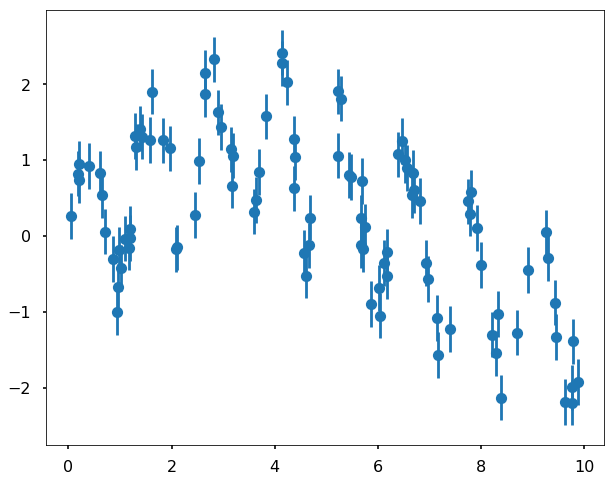
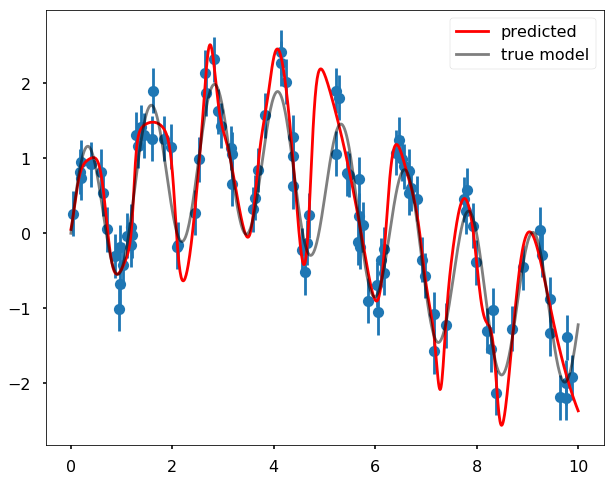

<h1>Регресія</h1>

Регресія — це набір алгоритмів у керованому навчанні, де вихідними даними є кількісні числа замість категоріальних даних. Ми розглядали регресію найменших квадратів у розділі 16 для простих випадків, коли ми маємо аналітичну форму для апроксимації даних. Але підхід машинного навчання є більш гнучким, оскільки ви можете апроксимувати будь-які функції даних, не знаючи при цьому базової аналітичної форми. Наприклад, для регресії можна використовувати випадковий ліс, штучні нейронні мережі, метод опорних векторів тощо. У цьому розділі ми представимо підхід штучних нейронних мереж (ШНМ), який є дуже гнучкою моделлю, що легко працює як з класифікацією, так і з регресією.

<h2>Основи штучних нейронних мереж</h2>

Метод <strong>штучних нейронних мереж</strong> розроблений для імітації роботи нашого мозку, тобто нейрони в нашому мозку отримують та обробляють інформацію, а потім певний процес контролює, чи буде нейрон надсилати сигнал сусіднім або специфічним нейронам. Наступний рисунок показує типову структуру багатошарової штучної нейронної мережі. Вона має 3 різні шари: вхідний шар, прихований шар та вихідний шар. У кожному шарі є нейрони, які показані на рисунку у вигляді кіл. З рисунка видно, що вхідний шар у цьому випадку має 3 нейрони, що відповідають 3 ознакам, які подаються на вхід мережі (ви, безумовно, можете мати більше ознак, а отже, більше нейронів у вхідному шарі). Середній шар — це прихований шар; ви також можете мати багато прихованих шарів, на цьому рисунку ми маємо лише 1 прихований шар для ілюстрації. Нейрони в прихованих шарах є основними обробними одиницями в мережі для обробки даних; зазвичай у кожному нейроні виконуються дві дії: (1) сумування інформації, переданої з попереднього шару, (2) передача суми інформації до функції активації, щоб вирішити, чи надсилати сигнал. Вихідний шар також має нейрони для генерації виходу; для класифікації він генерує число від 0 до 1, а для задачі регресії ми можемо генерувати будь-які числа. Ми бачимо багато стрілок між різними шарами, вони називаються зв'язками в нейронній мережі, і вони відповідають за передачу інформації від одного шару до іншого. Кожен зв'язок має пов'язану з ним вагу; це настроювані параметри, які ми можемо налаштовувати в моделі. Коли інформація надходить з вхідного шару, вона проходить через зв'язки до прихованого шару для обробки, а потім до вихідного шару для генерації результатів. Зазвичай це називається <strong>прямим поширенням</strong>.

Як описано вище, навчання алгоритму ШНМ полягає в пошуку способу налаштування ваг на кожному зі зв'язків. У ШНМ це робиться за допомогою функції втрат, яка обчислює помилки між оцінками моделі та справжніми цільовими значеннями. Спочатку ми виконуємо пряме поширення, щоб отримати оцінку та обчислити помилку, а потім поширюємо цю помилку назад від вихідного шару до вхідного шару. Залежно від внеску в помилки для кожного зв'язку, ми можемо оновити ваги на зв'язках, щоб переконатися, що наступного разу, коли ми будемо передавати інформацію вперед, помилка зменшиться. Це називається <strong>зворотним поширенням помилки</strong>; ми можемо передавати ту саму інформацію вперед і назад багато разів (це зазвичай називається епохами), щоб постійно зменшувати помилку, доки вона не задовольнить нашу мету. Так ми навчаємо алгоритм ШНМ. Зазвичай для оновлення ваг ми використовуємо алгоритм оптимізації, який називається <strong>градієнтним спуском</strong>.

Розглянемо приклад ШНМ у scikit-learn.

<strong>Генерація даних</strong>

По-перше, нам потрібно згенерувати іграшковий набір даних, який ми будемо використовувати для навчання моделі. Ми генеруємо періодичний набір даних, використовуючи дві синусоїди з різними періодами, а потім додаємо до нього трохи шуму. Його можна візуалізувати на наступному рисунку:

<pre>import numpy as np
import matplotlib.pyplot as plt
from sklearn.metrics import mean_squared_error
plt.style.use('seaborn-poster')
%matplotlib inline
</pre>

<pre>np.random.seed(0)
x = 10 * np.random.rand(100)

def model(x, sigma=0.3):
    fast_oscillation = np.sin(5 * x)
    slow_oscillation = np.sin(0.5 * x)
    noise = sigma * np.random.randn(len(x))

    return slow_oscillation + fast_oscillation + noise

plt.figure(figsize = (10,8))
y = model(x)
plt.errorbar(x, y, 0.3, fmt='o')
</pre>

<pre>&lt;ErrorbarContainer object of 3 artists&gt;
</pre>

Потім ми можемо використовувати ШНМ для апроксимації даних; основна ідея полягає в тому, щоб використовувати кожну точку даних у \(x\) як вхідну ознаку для ШНМ, а виходом буде послідовність - \(y\). У scikit-learn модель ШНМ для регресії називається <em>MLPRegressor</em>, що розшифровується як регресор багатошарового перцептрона. Використаємо вищезгадані зашумлені дані як вхідні для алгоритму ШНМ.

<pre>from sklearn.neural_network import MLPRegressor
</pre>

<pre>mlp = MLPRegressor(hidden_layer_sizes=(200,200,200), \
                   max_iter = 2000, solver='lbfgs', \
                   alpha=0.01, activation = 'tanh', \
                   random_state = 8)

xfit = np.linspace(0, 10, 1000)
ytrue = model(xfit, 0)
yfit = mlp.fit(x[:, None], y).predict(xfit[:, None])

plt.figure(figsize = (10,8))
plt.errorbar(x, y, 0.3, fmt='o')
plt.plot(xfit, yfit, '-r', label = 'predicted', \
         zorder = 10)
plt.plot(xfit, ytrue, '-k', alpha=0.5, \
         label = 'true model', zorder = 10)
plt.legend()
plt.show()
</pre>

Ми бачимо, що апроксимація даних насправді непогана. Для вищезгаданої моделі ми використали 3 приховані шари, і в кожному шарі ми використали 200 нейронів. Ми використовуємо алгоритм оптимізації — 'lbfgs', який є оптимізатором із сімейства квазіньютонівських методів. Параметр <em>max_iter</em> визначає, що ми виконаємо щонайбільше 2000 ітерацій.

